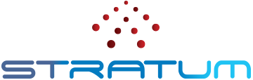
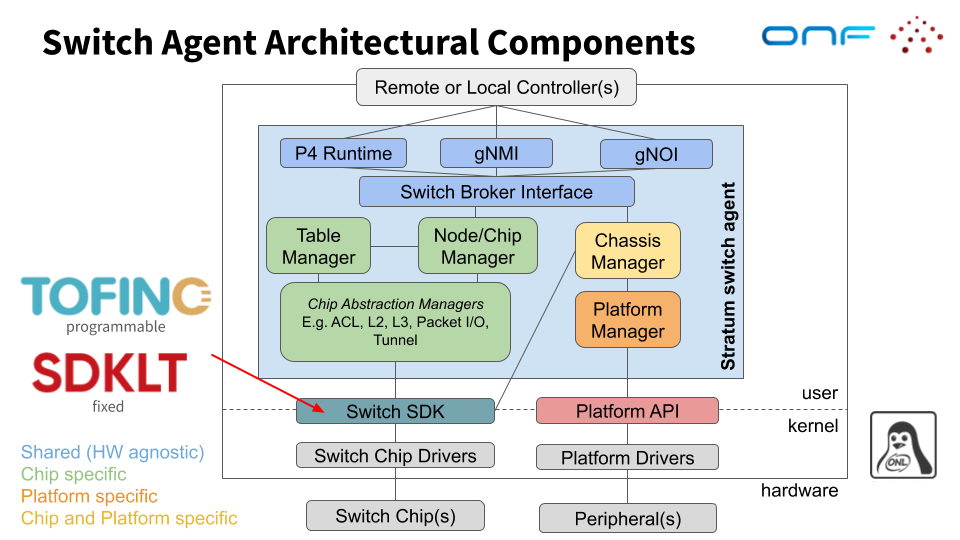

<!--
Copyright 2018 Google LLC
Copyright 2018-present Open Networking Foundation

SPDX-License-Identifier: Apache-2.0
-->

# Stratum - Enabling the era of next-generation SDN

Copyright 2018 Google LLC  
Copyright 2018-present Open Networking Foundation

Stratum is an open source silicon-independent switch operating system for software defined networks. It is building an open, minimal production-ready distribution for white box switches. Stratum exposes a set of next-generation SDN interfaces including P4Runtime and OpenConfig, enabling interchangeability of forwarding devices and programmability of forwarding behaviors. Current support includes Barefoot Tofino and Broadcom Tomahawk devices, as well as the bmv2 software switch.

Build status (master): 

# Documentation

## Getting Started with SDN / P4 / Stratum

If you're completly new to the world of P4 and are looking for step-by-step instructions with batteries included, the [NG-SDN](https://github.com/opennetworkinglab/ngsdn-tutorial) tutorial is a good starting point. For material more focused on P4 as a language, have a look at the [p4lang](https://github.com/p4lang/tutorials) tutorials. Finally, there is the "Software-Defined Networks: A Systems Approach" book ([HTML](https://sdn.systemsapproach.org/)) for comprehensive coverage of SDN. Also see the chapter about [Stratum](https://sdn.systemsapproach.org/stratum.html#thin-switch-os) in it.

## Running Stratum

[Broadcom](stratum/hal/bin/bcm/standalone/README.md)

[Tofino](stratum/hal/bin/barefoot/README.md)

[bmv2](stratum/hal/bin/bmv2/README.md)

[dummy](stratum/hal/bin/dummy/README.md)

[NP4 Intel](stratum/hal/bin/np4intel/docker/README.md)

## Other Topics

[p4c-fpm](stratum/p4c_backends/README.md)

[PHAL](stratum/docs/phal.md)

[PHAL Development Tutorial](stratum/docs/phal_development_tutorial.md)

[PHAL DB Configurators](stratum/docs/configurators.md)

[gNMI](stratum/docs/gnmi/README.md)

[cdlang](stratum/testing/cdlang/README.md)

[testvectors](stratum/public/proto/tv.proto)

[SSL/TLS support](stratum/lib/security/README.md)

[TAI](stratum/docs/tai/README.md)

# Component Overview

[P4Runtime](https://p4.org/p4-runtime) provides a flexible mechanism for
configuring the forwarding pipeline on a network switch.

[gNMI](https://github.com/openconfig/reference/tree/master/rpc/gnmi) is a
framework for network device management that uses gRPC as the transport
mechanism.

[SDKLT](https://github.com/Broadcom-Network-Switching-Software/SDKLT) is used
to program fixed-pipeline switches using the Tomahawk chip from Broadcom.

# Supported Devices

## Tofino

- Delta AG9064v1
- Edgecore Wedge100BF-32X
- Edgecore Wedge100BF-65X
- Inventec D5254
- Inventec D5264Q28B
- Inventec D10056
- Inventec D10064
- Netberg Aurora 610
- Netberg Aurora 710
- Netberg Aurora 750
- Stordis BF6064X
- Stordis BF2556X

## Broadcom

- Tomahawk
    - Edgecore AS7712-32X
    - Edgecore AS7716-24XC Cassini
    - Dell Z9100
    - Inventec D7032
    - QCT QuantaMesh T7032-IX1
- Tomahawk+
    - Edgecore AS7716-24SC Cassini
    - Inventec D7054
- Tomahawk2
- Tomahawk3
- Trident2
    - Edgecore AS6712
    - Inventec D6254
    
## Smart NIC

- Intel PAC N3000

## Software Switches

- bmv2
- dummy

# Source code

This repository contains source code for a reference implementation of
the P4Runtime and gNMI services, that serves as the hardware abstraction layer
for a network switch. It has been successfully prototyped at Google, running on
production hardware on a data center network subsystem.

# Development environment

We provide a script to create a Docker development environment for Stratum.

To start the container, run the following in your `stratum` directory:

    ./setup_dev_env.sh

The script will build a Docker image using Dockerfile.dev and run a bash session
in it. This directory will be mounted in the Docker image and you will be able
to run git, edit code, and build Stratum / run tests using Bazel.

For more information, you can see a complete list of arguments by running:
`setup_dev_env.sh -h`

If you are using Docker on Linux, make sure that you can use Docker as a
non-root user, otherwise you will not be able to run setup_dev_env.sh:

    sudo usermod -aG docker $USER
