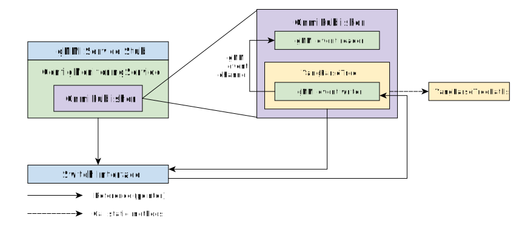
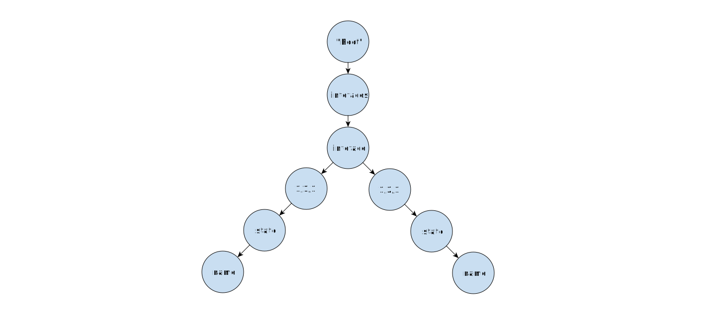
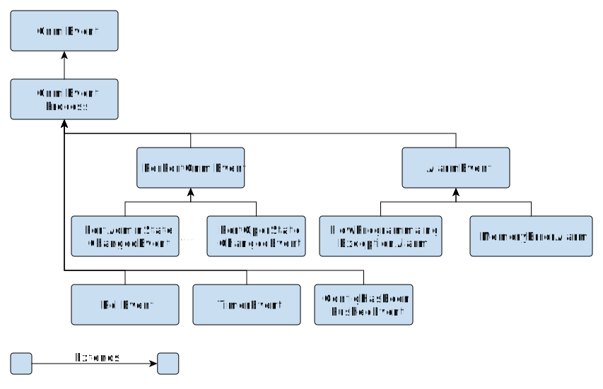
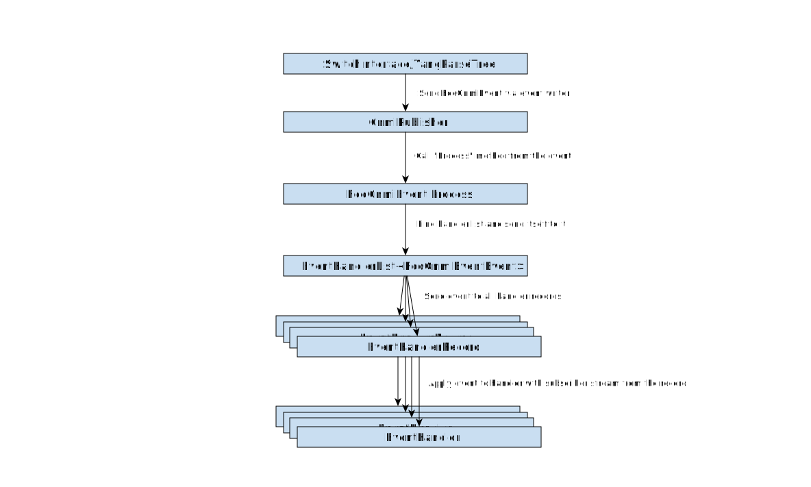
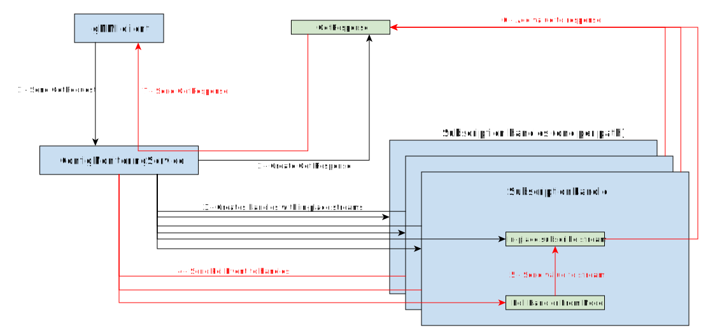
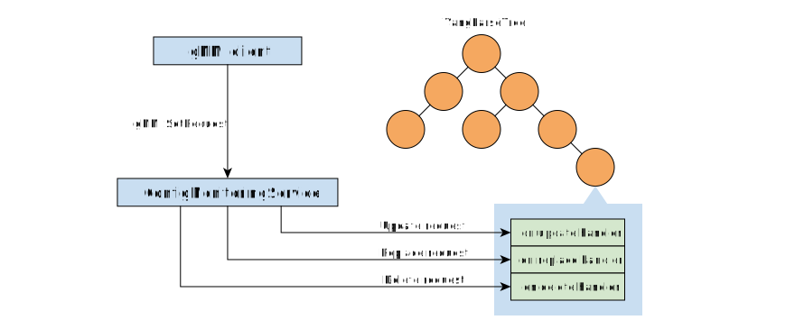

<!--
Copyright 2018-present Open Networking Foundation

SPDX-License-Identifier: Apache-2.0
-->

Config Monitoring Service (gNMI)
====

This file includes the following document for the **Config Monitoring Service**:

Table of contents
----

- [Config monitoring service architecture](#config-monitoring-service-architecture)
- [Service and tree initialization](#service-and-tree-initialization)
- [YangParseTree](#yangparsetree)
- [GnmiPublisher](#gnmipublisher)
- [Event, EventProcess, EventHandler, and EventHandlerList](#event-eventprocess-eventhandler-and-eventhandlerlist)
- [Handler registration and event processing](#handler-registration-and-event-processing)
- [Polling values from TreeNode](#polling-values-from-treenode)
- [Update/Replace/Delete value to TreeNode](#updatereplacedelete-value-to-treenode)
- [Add new gNMI path to Stratum](#add-new-gnmi-path-to-stratum)
- [The root path `/`](#the-root-path)
- [Supported gNMI paths](#supported-paths)


Config monitoring service architecture
----

The diagram below shows the high-level architecture of critical components which provides gNMI service and dependencies between them.



Key components are:

 - **ConfigMonitoringService**: Implementation of gNMI service, which handles all the RPCs that are part of gNMI. This class will check if the RPC calls are valid and pass the request to the `GnmiPublisher`.
 - **GnmiPublisher**: The main class responsible for handling all aspects of gNMI subscriptions and notifications. This class also maintains the `YangParseTree` which stores the switch's configuration and operational state.
 - **YangParseTree**: Generic tree structure used to build YANG model tree.
 - **YangParseTreePaths**: Contains implementation of all supported YANG paths (e.g. OpenConfig).

Service and tree initialization
----

 When the service is initialized, it creates a `GnmiPublisher`, and the `GnmiPublisher` instantiates the `YangParseTree`.
 When the tree is initialized, it generates default nodes for wildcard paths such as:

  - `/interfaces/interface[name=*]/state/ifindex`
  - `/interfaces/interface[name=*]/state/name`
  - `/interfaces/interface/...`
  - `/`

YangParseTree
----

The `YangParseTree` uses `TreeNode` objects to represent nodes and leaves of the tree and provides additional methods to work with the tree.

Note: a `TreeNode` does not store the value of a leaf. The way to get the value from the leaf node is to use functor that is stored as a handler in the `TreeNode`.

In general, there are four types of operations supported by the tree:

**Read**

In response to gNMI Get requests or subscriptions of type sampled or poll, a functor is provided for each leaf that retrieves a value. For configuration state, the value is typically embedded in a functor instance and returned when the functor is called. The value is updated by creating a new functor with a new captured value, and the functor pointer is replaced (typically by the set functor). For operational or other state, the functor makes calls to `SwitchInterface::RetrieveValue()` to retrieve the latest value. The convention is to call this type of functor *poll-functor*. This functor is also responsible for sending the value to the subscription client.

The poll functor is usually registered for two of a `TreeNode` handlers:
- The on timer handler, which is called in response to a timer event for a given sampled subscription
- The on poll handler, which is called in response to a client poll request for poll subscription as well as for gNMI Get requests

Technically, a tree could have different read functors for the timer handler and poll handler, but we don't have a good use case for that at the moment.

Note that the **Subscriber** can be a temporary in-place subscriber in `ConfigMonitoringService`.

**Callback**

For gNMI on change and target defined subscriptions, a functor is provided which listens for changes from the underlying system (e.g. a change in port operation state). There are actually two functors involved here.

The first is the on change register functor (called *register_functor*) which is used to subscribe a leaf node to a particular type of events. The functor is registered as a `TreeNode`'s on change registration, which is called for each subscribed leaf when an on change subscription is created.

The second is the on change functor which converts an event (of the registered type) into an update which is sent to the subscription client. The new value is not typically stored in the tree as the functor is purely a stateless mapper. The functor is registered as a `TreeNode`'s on change handler, which gets called whenever the GnmiPublisher receives an event of the type that is registered by the first functor.

**Write**

For gNMI set requests, a functor is provided which accepts new values for configuration state, which is typically called *on_set_functor*. This functor is responsible for processing the new value, and then either (i) passing the new value to `SwitchInterface::SetValue()` (if the poll functor retrieves its value from switch interface) or (ii) creating a new functor that returns the new value and updating the on poll and on timer handlers for this node.

This functor is usually registered as both the on update handler and on replace handler, which is called when the client sends a gNMI Set message with either the update or replace fields set, respectively.

**Deletion**

For gNMI set requests that delete a path, a functor is provided which is called before the `TreeNode` is removed.

Currently, this functor is not implemented on any path.

Each node can also represent the `path element` or `element key` of the gNMI path. If the node represents an `element key`, `is_name_a_key_` of this node must be set.

Diagram below shows a tree example for `/interfaces/interface[name='1/1/1']/state/name` and `/interfaces/interface[name='1/2/1']/state/name` paths.



GnmiPublisher
----

The `GnmiPublisher` maintains the `YangParseTree`. This component does the following things:

 - Write to the tree: handles update/replace/delete request from the gNMI client by calling the handler of the tree node.
 - Subscribe from the tree node: creates `SubscriptionHandle` for specific tree node (gNMI path) and register an event handler to the tree node (gNMI path).
 - Apply the gNMI events to specific event handler from a tree node directly (e.g. PollEvent).
 - Handle gNMI events from `YangParseTree` and `SwitchInterface`.


Event, EventProcess, EventHandler, and EventHandlerList
----

All gNMI related event classes can be found in `gnmi_events.h` file.

Every type of gNMI event extend `GnmiEvent` class which includes `Process` method. The processing is different for every kind of an event.

The `GnmiEventProcess` class implements `Process` method that finds an instance of the `EventHandlerList` class that holds references to all handlers interested in this type of events and passes the event for processing.

The diagram below shows the inheritance of gNMI event classes



Handler registration and event processing
----

Every gNMI event handler must process the event and send the result to the subscriber via the `GnmiSubscribeStream`. `EventHandlerRecord` is a class which holds the event handler and the subscriber stream.

After the `EventHandlerRecord` created, use C++ template magic to find the event handler list and register it.

```cpp
// Register eventHandlerRecord for GnmiEventClass event
EventHandlerList<GnmiEventClass>::GetInstance()->Register(eventHandlerRecord);

// To unregister the handler
EventHandlerList<GnmiEventClass>::GetInstance()->UnRegister(eventHandlerRecord);
```

After registration, the event will be applied to the handler with subscriber stream automatically when `Process` method from `GnmiEvent` called.



Polling values from `TreeNode`
----

To poll value from a `TreeNode` (gNMI Poll or Get), the config monitoring service creates a `SubscriptionHandle` which combines the poll handler and stream of the subscriber and pass a `PollEvent` to it.

If the gNMI client subscribe gNMI paths using `poll` mode, the config monitoring service stores all `SubscriptionHandle` it created and pass `PollEvent` to handles if client send poll request.


If the gNMI send a `GetRequest` to the service, the service create a temporary in-place subscribe stream (`InlineGnmiSubscribeStream`) which updates result in `GetResponse` and send the response back to client.



Update/Replace/Delete value to `TreeNode`
----

To Update/Replace/Delete the value of a gNMI path, the config monitoring service gets the update/replace/delete handler from the tree node of the path and applies value directly to the handler.

Note that some update/replace/delete handler may also send notifications after tree node updated.



Add new gNMI path to Stratum
----

To add new gNMI path to `YangParseTree`, add `TreeNode` to the tree by calling:

```cpp
// YangParseTree* tree;
TreeNode* node = tree->AddNode(GetPath("A")("B")("C")("D")());
```

This create a `TreeNode` for gNMI path `/A/B/C/D`.

After node initialized, add handlers to the node:

```cpp

auto poll_functor = [](const GnmiEvent& event,
                       const ::gnmi::Path& path,
                       GnmiSubscribeStream* stream) {
  // Poll value from switch interface or wherever you want
  // and send to stream
}

// The handler handling the gNMI on change subscription
auto register_functor = RegisterFunc<GnmiEventClassForThisNode>();
auto on_change_functor = [](const GnmiEvent& event,
                            const ::gnmi::Path& path,
                            GnmiSubscribeStream* stream) {
  // Gets updated value from GnmiEvent, convert to
  // value supported by gNMI (e.g. string) and send to stream
};
auto on_update_functor = [](const ::gnmi::Path& path,
                            const ::google::protobuf::Message& val,
                            CopyOnWriteChassisConfig* config) {
  // Sets value to switch
};

node->SetOnTimerHandler(poll_functor)
     ->SetOnPollHandler(poll_functor)
     ->SetOnChangeRegistration(register_functor)
     ->SetOnChangeHandler(on_change_functor)
     ->SetOnUpdateHandler(on_update_functior);
```

Note that if the default handler is an empty handler which returns `OK` or `UNAVAILABLE` status.

Please find more example from [`yang_parse_tree_paths.cc`](../../hal/lib/common/yang_parse_tree_paths.cc) for tree node creation.

The root path
----

The root path `/` is a special path which is for set and get of the entire chassis config. The chassis config needs to be converted to the OpenConfig model before set or get.

Stratum uses Yang to Protobuf compiler to compile the OpenConfig Yang model to protobuf files. You can find the protobuf file under the `public/proto/openconfig` directory.

Supported paths
----

See [supported-paths](supported-paths.md)

OpenConfig Model
----

For an overview of the complete OpenConfig tree, have a look at the interactive
[HTML](http://ops.openconfig.net/branches/models/master/) version.
