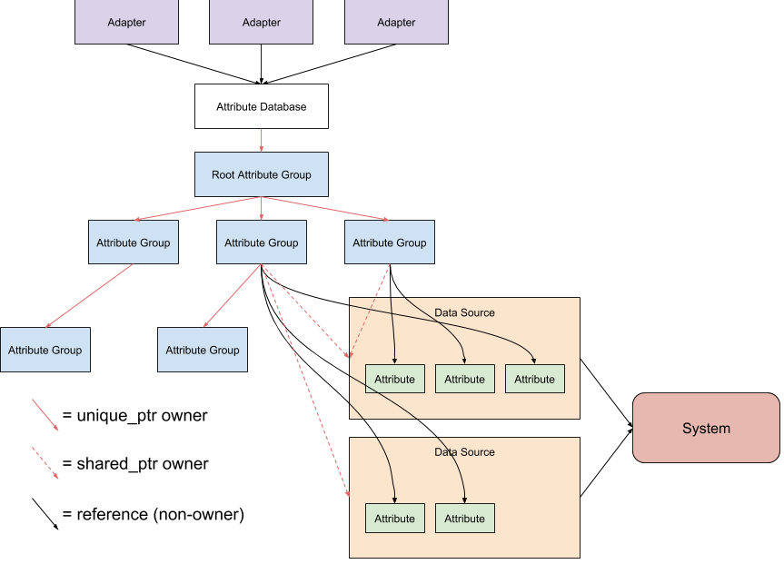

# Stratum PHAL Overview (Physical Hardware Access Layer)

[TOC]

## Useful links

For in-depth information about modifying the PHAL, see the [PHAL development
tutorial.](phal_development_tutorial.md)

### Design docs

[Detailed PHAL design doc]

[PHAL streaming query design doc]

## Database Structure and Definitions

This section gives a very high level overview of the PHAL attribute database.
Knowledge of the database structure is not required to access the database. For
modifying the database, more in-depth information may be found in the PHAL
development tutorial linked above.

The diagram above shows all of the ownership relationships within an attribute
database. These relationships are designed such that deleting an attribute
database will safely clean up all data structures and threads.

### Attribute Database Definitions

**Attribute Database**: A database of values describing various system hardware
attributes. This database is structured as a tree, with only leaf nodes storing
actual attributes. The attribute database is responsible for reading these
values from the system, and performs any necessary caching.

**Attribute Group**: A single internal (non-leaf) node in the attribute
database. An attribute group may contain any number of attributes (leaf nodes)
and child attribute groups, each with a distinct string name.

**Attribute**: A leaf node in the attribute database. Stores a single system
attribute. An attribute may store a numerical, boolean, string, or enum value.

**Data Source**: A class that reads from the system, parses the information read
into individual values, and writes these values to attributes. Data sources are
the direct owners of their attributes; when an attribute is added to an
attribute group, the attribute group only stores a reference. During runtime,
data sources are responsible for keeping attribute values up to date, as well as
caching values whenever necessary.

##### Database components not shown in the diagram above:

**Configurator**: The code that inspects the system and any system config files,
creates datasources to access the system, and structures their attributes into
the attribute database.

**Runtime Configurator**: A piece of configurator code that can run multiple
times at runtime. Runtime configurators are written for each device that can be
added or removed, or change state significantly at runtime. These configurators
change the structure of the attribute database rather than just changing
individual attribute values. This means that the presence or absence of an
individual attribute or attribute group is just as significant as the value
stored.

## PHAL Adapters

This section describes all of the adapters that may be used to access fields in
the PHAL. For help writing new Adapters, see the PHAL development tutorial
linked at the top of this file.

TODO({{USERNAME}}): Add a section here for any new adapters you write!

### Stratum PHAL Interface

The Stratum PHAL provides an implementation of
google3/platforms/networking/stratum/hal/lib/common/phal_interface.h. This
implementation can be found at
google3/platforms/networking/stratum/hal/lib/phal/google_phal.h. This interface
is used to query information about transceivers, and to receive messages
whenever transceivers are plugged or unplugged.
