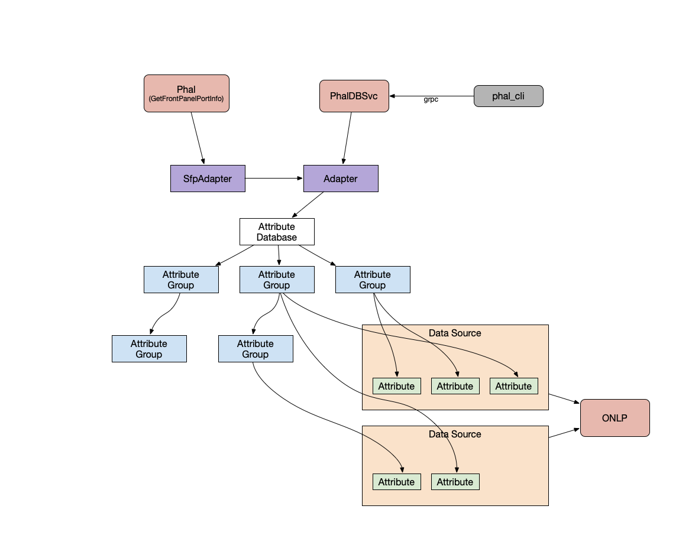

## Stratum PHAL Development Tutorial

[TOC]

### PHAL Overview

The Physical Hardware Access Layer (PHAL) is responsible for managing
all of the basic hardware information in the Stratum switch stack. This
includes things like temperature sensor readings, the type of transceiver
present in a port, or the maximum voltage of a power supply. It also includes
simple interfaces for modifying hardware state, such as changing the speed of a
fan, or power cycling a card.

The PHAL must run on top of many different types of hardware, and will be
accessed by many different types of client. There is no guarantee that hardware
of a given type will always have the same interface, and there's no guarantee
that clients will always access data in a similar way. In order to support these
many environments, the PHAL is broken into several layers:

*   A set of **data sources** are responsible for accessing the system and
    hardware directly. These DataSources each manage one or more **attributes**:
    individual pieces of information about the system, e.g. a data source might
    be responsible for reading a sysfs file that contains a temperature sensor
    reading and converting it to a float. Attributes are always readable, but in
    some cases they are writable as well; you may want to know the rpm of a fan,
    but you likely also want to be able to change it. Data sources are also
    responsible for writing to the system in these cases.
*   The **attribute database** is a tree structure responsible for storing
    attributes. Each node in the tree has a name, and individual attributes can
    be addressed using a path into the tree. The schema for the attribute
    database is defined by a protobuf. Inner nodes in the tree are called
    **attribute groups**.
*   A set of **configurators** read any relevant configuration files, then
    populate the attribute database. This means creating all of the data sources
    that are required to read system attributes, then taking those attributes
    and inserting them into the appropriate place in the attribute database. A
    **runtime configurator** is a special type of configurator that is
    responsible for adding or removing attributes from the attribute database
    when the state of the hardware changes. For instance, it doesn't make sense
    to have an attribute containing the serial number of a transceiver unless
    that transceiver is actually plugged into a port.
*   A set of **adapters** define outward-facing interfaces to the attribute
    database. Regardless of the type of interface, an adapter converts every
    request into a path (or paths) into the attribute database, queries the
    database using the path(s), parses the result, and generates an appropriate
    response. The attribute database handles all synchronization, so any number
    of adapters can run in parallel.


<center>*Anatomy of a PHAL* </center>

Note that the attribute database is a single point of contact between clients
and the system itself. Everything above the attribute database only needs to
know the schema of the database, which is fixed between all different systems.
Thanks to this constraint, anything built on top of the PHAL can be ported to
other systems with relative ease.

### Development Principles

Clean abstraction should always be favored over one-shot development. This PHAL
will support an unknown set of new hardware in the future, and development
should anticipate this. When new types of behavior are encountered, abstractions
should be added or extended to support this behavior. This is especially true
when considering data sources, but should be extended to all other aspects of
the PHAL.

### Writing Data Sources

A data source is responsible for performing some sort of access to the system
and processing the results into a set of attributes. This could be as simple as
checking if a file exists and generating a boolean attribute, or as involved as
executing a script and parsing the output into many attributes of different
types. In any case, data sources should be designed for reuse and flexibility.

The only hard constraint on what a data source can do is that it must not
interact with any other data source. It must be okay for any two data sources to
perform their system accesses simultaneously without altering their behavior.
This constraint is required for the locking structure of the attribute database
to work correctly.

Data source implementations rely on a couple parts of the phal implementation.
More specific details and justifications can be found in these headers:

[stratum/hal/lib/phal/datasource.h](../hal/lib/phal/datasource.h)

Data source implementations must derive from the abstract class DataSource
defined in this header. They should override the constructor to perform any
necessary setup, and should define `UpdateValues()` to perform a system access.
Note that the DataSource constructor accepts a CachePolicy; any new constructor
should accept a CachePolicy and pass it to the base constructor. The CachePolicy
is used by the base DataSource implementation to automatically cache all
attributes. `UpdateValues()` is not called if the CachePolicy indicates that
previously fetched values are still fresh enough. Also note that the DataSource
constructor is protected. All data sources must expose a factory function that
returns a shared_ptr, and should typically have a non-public constructor.

[stratum/hal/lib/phal/managed_attribute.h](../hal/lib/phal/managed_attribute.h)

This header defines the ManagedAttribute interface, as well as implementations
TypedAttribute and EnumAttribute. When a data source reads some system
attribute, it should store the result in a ManagedAttribute. The
ManagedAttribute will cache this value until the next time it is read from the
system, i.e. the next time `UpdateValues()` is called. Each data source
implementation should define an interface for accessing pointers to each of its
ManagedAttributes.

#### Example

Suppose we frequently need to check if a file exists. To support this case in
general, we could define a new data source:

```
class FileExistsDataSource : public DataSource {
 public:
  // Every DataSource implementation must expose a shared_ptr factory function.
  static std::shared_ptr<FileExistsDataSource> Make(const std::string& path,
                                                    CachePolicy* cache_policy) {
    return std::make_shared<FileExistsDataSource>(path, cache_policy);
  }

  // Our interface must expose pointers to each of our managed attributes.
  ManagedAttribute* GetFileExistsAttribute() { return &file_exists_; }

 protected:
  // We pass the cache_policy to DataSource(), then do our own initialization.
  FileExistsDataSource(const std::string& path, CachePolicy* cache_policy)
      : DataSource(cache_policy), path_(path) {}

  // UpdateValues needs to perform our system access (check if path_ exists), and
  // store all gathered information in managed attributes. In this instance this is
  // very simple, but UpdateValues will often perform complex tasks.
  ::util::Status UpdateValues() override {
    file_exists_.AssignValue(FileExists(path_));
  }

 private:
  std::string path_;
  // Due to the structure of the database, we need to construct each managed
  // attribute with a pointer to its managing DataSource (i.e. this).
  // In this case, file_exists_ is our only managed attribute.
  TypedAttribute<bool> file_exists_ {this};
};
```

### Using the Attribute Database

The attribute database is a tree structure that stores attributes. Each node in
the tree has a label, and specific nodes (inner and leaf) can be addressed using
paths through the tree structure. This structure is defined by a [schema
protobuf](../hal/lib/phal/db.proto),
with `message PhalDB` corresponding to the root node of the database.

The database schema is a normal protobuf, with one limitation: repeated fields
containing basic types are not allowed. A repeated field containing instances of
another protobuf message is permitted, but a repeated field containing integers
is not. In the database, these repeated fields are referred to as **repeated
attribute groups**.

Once fully constructed, an attribute database is stored in an instance of
[AttributeDatabase](../hal/lib/phal/attribute_database.h), which is itself an
implementation of [AttributeDatabaseInterface](../hal/lib/phal/attribute_database_interface.h?rcl=167338851&l=68).
AttributeDatabaseInterface is the outward facing interface used by adapters to
query the database. Under the hood, the tree structure of the database is
defined using
[AttributeGroup](../hal/lib/phal/attribute_group.h) for inner nodes and
[ManagedAttribute](../hal/lib/phal/managed_attribute.h) for leaf nodes.

#### Constructing the Database

Constructing the full attribute database is the job of configurators, and is
described more comprehensively in the "Writing Configurators" section below.

During construction a pointer to the root AttributeGroup of the database is held
rather than an actual AttributeDatabase. This root node is passed to an instance
of AttributeDatabase once construction is complete.

In order to actually modify an AttributeGroup, a lock must be acquired. Each
AttributeGroup contains an r/w lock, which can be acquired by calling
`group->AcquireMutable()` or `group->AcquireReadable()`. When constructing the
attribute database, calling `AcquireMutable()` for a writer lock is typically
desired. The returned MutableAttributeGroup provides an interface for modifying
the contents of the AttributeGroup.

#### Accessing the Database

AttributeDatabaseInterface has two calls for accessing the database: `Set()` and
`MakeQuery()`, for writing and reading attributes respectively. In either of
these cases, the user must specify paths into the attribute database using a
vector of
[PathEntry](../hal/lib/phal/attribute_database_interface.h?l=36).
PathEntry is mostly self explanatory, but also includes a few fields that allow
wildcard queries.

```
// A simplified definition of PathEntry. The actual definition includes some
// constructors to simplify the process of specifying a path.
struct PathEntry {
  // The name of the next attribute group in the path. If this is the last entry
  // in the path, this is the name of an attribute instead. In the simplest case,
  // this is the only field of PathEntry which needs to be set.
  std::string name;
  // If indexed == true, this PathEntry refers to a repeated attribute group. If
  // all == true as well, we should query every index in this group. Otherwise,
  // query only the specified index.
  bool indexed = false;
  int index = 0;  // Ignored if indexed == false.
  bool all = false;  // Ignored if indexed == false.
  // If terminal_group == true, this PathEntry is the last entry in our path, but
  // still refers to an attribute group. Instead of querying a single attribute,
  // we will query every attribute contained in this group and its children.
  bool terminal_group = false;
};

// A convenience alias so we don't need to write std::vector everywhere.
using Path = std::vector<PathEntry>;
```

Bear in mind that all paths into the database are considered optional. A path is
considered perfectly valid so long as it matches the database schema -- the
actual fields in the path need not be populated in the attribute database.

`Set()` is straightforward: it accepts a map from path to value, and writes the
specified values to each specified path. An error is returned if the path is
invalid or if writing to the system fails. A couple caveats: A success return
does *not* guarantee that all specified paths were written, since some paths may
not be present in the database; In the case where a wildcard path is given as a
key, all matching paths are set; If multiple paths match the same field, one of
the matching paths is selected arbitrarily.

`MakeQuery()` provides two ways to read from the database: one-shot (`Get`), and
streaming (`Subscribe`). In either case, we take a list of paths into the
database, read the matching attributes, and populate an instance of the database
schema protobuf with the results. The initial call to `MakeQuery` only validates
the path entries. Subsequent calls to `Get` and `Subscribe` on the returned
`Query` object actually access the database.

As an example, suppose we want to query the speed of a fan once every second. We
might write something like this:

```
::util::Status SubscribeToFanSpeed(
      int tray, int fan, std::shared_ptr<Channel<PhalDB>> channel) {
  // This path points to to fan_trays[0]/fans[2]/rpm.
  Path path = {
      PathEntry("fan_trays", tray),
      PathEntry("fans", fan),
      PathEntry("rpm")
  }
  // We wrap our path in {...} to make a vector, but we only want to query one
  // path right now.
  ASSIGN_OR_RETURN(std::unique_ptr<Query> query,
                   database_interface->MakeQuery({path}));

  // We write our streaming fan speed info to the channel.
  std::unique_ptr<ChannelWriter<PhalDB>> output =
      ChannelWriter<PhalDB>::Create(channel);
  // Now we can actually establish our subscription. We will continue to send
  // updates on this subscription until the channel closes. If at some point the
  // fan is removed, we will resume sending updates when it is reinserted.
  RETURN_IF_ERROR(query->Subscribe(std::move(output), absl::Seconds(1)));
  return ::util::OkStatus();
}
```

This will send update messages about once every second with the format:

```
fan_trays {
  fans {}  // 0
  fans {}  // 1
  fans {   // 2
    rpm = 123.45
  }
}
```

To minimize spurious work, no update is sent if the result of the query is
unchanged from the previous update.

**Exercise:** *How should we modify the above code to query both fan 2 and fan
5? How about querying every fan in every fan tray?*

For more detailed info about how the attribute database works, check out [the
design doc]().

### Writing Configurators

A configurator is responsible for creating data sources and inserting their
attributes into the attribute database. This means that the configurator is the
only part of the PHAL that has knowledge of both the attribute database
schema and the underlying system. Some knowledge of the underlying system is
abstracted away by data sources, but configurators nonetheless must have a full
understanding of where each attribute resides in the system.

There is no exact template for how a configurator should behave. However, it
will typically be a single function that is responsible for populating a small
number of attribute groups (typically one), which then delegates to other
functions to populate any children that are attribute groups. This function
takes an `AttributeGroup*` as input, acquires a writer lock on it (via
`AcquireMutable()`), then adds attributes and child attribute groups. Such a
function often also takes a configuration message as input.

**Note:** The switch configurators have been fully documented [here](configurators.md)

#### Example

Let's try configuring an AttributeGroup to contain the boolean attribute we
generated previously with our FileExistsDataSource. Suppose our database schema
contains:

```
message PhalDB {
  RemovableDevice device = 1;
}

message RemovableDevice {
  bool is_present = 1;
}
```

We want to first populate our PhalDB with a RemovableDevice, then populate the
RemovableDevice with the is_present attribute. This might look something like:

```
::util::Status ConfigurePhalDB(const std::string& presence_path,
                               AttributeGroup* root_group) {
  // First acquire a writer lock on root_group.
  auto mutable_root_group = root_group->AcquireMutable();
  // Now we need to add the RemovableDevice that will contain our attribute.
  // AddChildGroup() actually returns a ::util::StatusOr, which is why we must use
  // ASSIGN_OR_RETURN instead of just assigning the result to device.
  ASSIGN_OR_RETURN(auto device, mutable_root_group->AddChildGroup("device"));
  // AddChildGroup() returns an AttributeGroup*. We need to acquire a writer lock
  // on this group as well.
  auto mutable_device = device->AcquireMutable();
  // Now we make our data source. Notice that we pass in a CachePolicy when
  // constructing this data source -- the configurator is responsible for deciding
  // on a specific caching policy. In this case, we'll cache this attribute for one
  // second every time we check if the file exists. Other cache policies can be
  // found in datasource.h.
  std::shared_ptr<FileExistsDataSource> datasource =
      FileExistsDataSource::Make(presence_path, new TimedCache(absl::Seconds(1)));
  // Now we have both our attribute group and our data source. We can get the
  // attribute from the data source and add it to the attribute group. AddAttribute
  // returns ::util::Status, so we must check the result with RETURN_IF_ERROR.
  RETURN_IF_ERROR(mutable_device->AddAttribute(
                      "is_present", datasource->GetFileExistsAttribute()));
  // We have successfully configured root_group. Now we can return, and by doing
  // so we release the writer locks we've acquired on our attribute groups.
  return ::util::OkStatus();
}
```

Our attribute database now has this structure:


As mentioned in the above code snippet, configurators are responsible for
selecting a caching policy each time they construct a data source. The available
cache policies are:

```
// Values remain cached for the given duration after after each UpdateValues().
TimedCache(absl::Duration cache_duration);

NoCache();  // There is no cache. UpdateValues() values every time they are read.

FetchOnce();  // UpdateValues() the first time they are read, then cache forever.

NeverUpdate();  // Never UpdateValues(). All attributes are set in the constructor.
```

Additional cache policies may be added if necessary.

**Exercise:** *How could we extend our database schema and `ConfigurePhalDB()`
if we have two removable devices, each with their own presence path? How about
if we have an arbitrary, configurable number of removable devices?*

#### Runtime Configurators

Sometimes it's not possible to completely configure the attribute database at
startup. The most common instance of this is for removable devices. If one of
our fan trays isn't present in hardware, it doesn't make sense to store a fan
speed attribute for each fan -- these values are meaningless. Instead, we would
like to add these attributes to the database whenever the fan tray is actually
inserted, and delete them from the database if the tray is removed again.

In these cases, we can write a runtime configurator. This is a callback that
executes whenever there is a hardware event, and that acquires a writer lock on
a subset of the attribute database. For instance, if we have a removable fan
tray, the database might initialize and configure a group to store information
about individual fans. If the fan tray is then removed, a hardware event (e.g. a
udev event) is triggered, and we callback into our runtime configurator code. We
acquire a writer lock on the fan tray group so that we won't interfere with any
ongoing read operations, delete all of the info about individual fans, then
populate the necessary fields to indicate a missing fan tray.

#### Example Runtime Configurator

We'll write a runtime configurator for a `RemovableWidget`. The format of
runtime configurators is slightly different depending on how we receive hardware
events, so for this example we'll assume that udev is the source of all events.

```
// This class is the runtime configurator, and registers itself as a callback.
// It derives from UdevEventCallback so that it can receive udev events via
// HandleUdevEvent(...). It also implements RuntimeConfiguratorInterface, an empty
// interface that exists solely so that an AttributeGroup can store a list of
// runtime configurators. This is done for lifetime management -- when an attribute
// group is deleted, all of the runtime configurators that would change that group
// are also deleted (and automatically unregistered from the udev event handler, in
// this case).
class RemovableWidgetConfigurator
   : public UdevEventCallback,
     public AttributeGroup::RuntimeConfiguratorInterface {
 public:
  // We initialize this class as a udev event callback by specifying the specific
  // udev events we'd like to capture. In this case, we're monitoring a udev event
  // with the "gfpga-removables" filter, and a user specified device path. We'll
  // only see udev events related to this specific device. We also save a reference
  // to the attribute group that this configurator is responsible for modifying.
  RemovableWidgetConfigurator(AttributeGroup* widget_group,
                              const std::string& presence_path)
      : UdevEventCallback("gfpga-removables", presence_path),
            widget_group_(widget_group), presence_path_(presence_path) {}

  // This isn't necessary, but it doesn't make sense for our configurator to be
  // copyable.
  RemovableWidgetConfigurator(const RemovableWidgetConfigurator&) = delete;
  RemovableWidgetConfigurator& operator=(
      const RemovableWidgetConfigurator&) = delete;

  // This is where we actually handle all of our udev events. While different
  // types of runtime configurator may not follow exactly this format, they will
  // all have a function like this that's responsible for actually executing
  // changes in the attribute database.
  ::util::Status HandleUdevEvent(const std::string& action) override {
    // First things first, we acquire our writer lock. Once we have this lock, we
    // can safely make any changes to this group, or to any children of this group.
    auto mutable_widget_group = widget_group_->AcquireMutable();

    // Our theoretical widget attribute group has a field that stores the current
    // presence status, and a field the reads the widget's current widget monitor
    // (an important value for any removable widget!)
    if (action == "add") {
      auto datasource = FixedDataSource<std::string>::Make("Widget is present!");
      auto widget_datasource = WidgetDataSource::Make(presence_path_);
      // Note that we don't need to remove the "status" attribute before adding a
      // new one. Unlike adding child groups, adding an attribute will overwrite
      // any previous value.
      mutable_widget_group->AddAttribute("status", datasource->GetAttribute());
      mutable_widget_group->AddAttribute("widget_monitor",
                                         widget_datasource->GetWidgetAttribute());
    } else if (action == "remove") {
      auto datasource = FixedDataSource<std::string>::Make(
          "Uh oh, the widget is missing!");
      mutable_widget_group->AddAttribute("status", datasource->GetAttribute());
      // There's no widget monitor for a removable widget, so we delete the
      // the attribute when the widget is removed. It'll be added back whenever the
      // widget is added again.
      mutable_widget_group->RemoveAttribute("widget_monitor");
    }
    // It's possible for other udev events such as "change" to occur, but we ignore
    // them for simplicity's sake.
  }

 private:
  // In real configurators, we'll typically also keep some configuration protobufs
  // here.
  AttributeGroup* widget_group_;

};
```

### Writing Adapters

The structure of an adapter is dependent on how it's supposed to be used. In
most cases, an adapter is just a set of functions that translate their
parameters into a database query. Alternatively, an adapter could have one query
that it executes every time, then return a subset of the results. If streaming
queries are needed, an adapter can either communicate with it's client using a
channel (in which case the normal subscription mechanism is all that's
necessary) or it can make callbacks to its client, in which case a new thread is
necessary.

#### The Adapter class

There is a simple `Adapter` class that provides the basic `Get()`, `Subscribe()` and
`Set()` PhalDB functions by mapping to their appropriate counterparts in the
attribute_database_interface.  This class can be used as the base class for application specific
adapter classes.  

The `SfpAdapater` class is one such example of a derived adapter class that handles the
translation of attribute database query responses (i.e. in PhalDB protobuf messages) to HAL
specific messages (i.e. the FrontPanelPortInfo message from the [hal.proto](../public/proto/hal.proto)
protobuf used in the `GetFrontPanelPortInfo()` function).



### The PhalDB grpc service

The PhalDB has been exposed via a set of grpc services (see the [db.proto](../hal/lib/phal/db.proto) 
protobuf for a complete list of services) that allow the caller to `Get()`, `Subscribe()`
or `Set()` PhalDB attributes via a grpc call. 

This can be very useful for debugging problems with the hardware or even to get telemtry
directly without needing to go through the gnmi.  The db.proto protobuf file details the
services that are available and the message structure of these requests.

### The PhalDB cli tool

A PhalDB grpc client tool has been written to collect information from the PhalDB via
this grpc interface (i.e. while stratum is running).  This can be used to debug hardware
problems or even test code that is not easily tested in a simulated environment (i.e. dynamic
configurator testing).

This tool can be built as follows:

```
~/stratum$ bazel build //stratum/hal/lib/phal:phal_cli
Starting local Bazel server and connecting to it...
INFO: Analysed target //stratum/hal/lib/phal:phal_cli (42 packages loaded, 2655 targets configured).
INFO: Found 1 target...
Target //stratum/hal/lib/phal:phal_cli up-to-date:
  bazel-bin/stratum/hal/lib/phal/phal_cli
INFO: Elapsed time: 11.331s, Critical Path: 0.30s
INFO: 0 processes.
INFO: Build completed successfully, 1 total action
```

once built the executable can then be run either from the stratum machine locally or remotely by specifying
the correct stratum url to the command.

```
stratum$ ./bazel-bin/stratum/hal/lib/phal/phal_cli --stratum_url <stratum-ip-address>:28000
```

Once connected queries can be made against a live stratum PhalDB by entering a search
path using the db.proto path tree as a syntax reference.  

The high level steps of the phal_cli command are as follows:
1. Reads the given string into a grpc PhalDBSvc GetRequest message.
2. Sends the GetRequest to the stratum server as a grpc call.
3. The PhalDBSvc in the stratum server will construct a PhalDB Path from the query string to query the database.
4. The PhalDBSvc will then call the `Get()` function in the PhalDB Adapter to query the database and return a PhalDB message to the client.
5. The phal_cli command will then print out the response from the stratum PhalDB.

The query string should consist of at least one '/' separated field. Each field is an attribute group
or attribute name followed by an optional index. The index is bracketed, and consists of either a 
non-negative integer or '@' indicating all indices. The last field may optionally end with a '/' to 
indicate a terminal group.

Some valid examples:
* Get All cards: "cards[@]/"
* Get Card 0: "cards[0]/"
* Get Card 0 Port 0: "cards[0]/ports[0]/"
* Get Card 0 Port 0 hardware state: "cards[0]/ports[0]/transceiver/hardware_state"
* Get Fan Tray 0: "fan_trays[0]/"
* Get PSU Tray 0: "psu_trays[0]/"
* Get LED Group 0: "led_groups[0]/"
* Get Thermal Group 0: "thermal_groups[0]/"

Some invalid examples:
* "/"  (at least one field is required)
* "foo//bar"
* "foo/bar[-1]/"


Some example output from the card queries are shown below:

```
Enter a PHAL path: cards[0]/
phal_db {
  cards {
    ports {
      transceiver {
        id: 1
        description: "SFP 0"
        hardware_state: HW_STATE_PRESENT
        info {
          mfg_name: "DELL            "
          serial_no: "CN0769626BB47BD "
          part_no: "P7C7N           "
        }
        connector_type: SFP_TYPE_QSFP28
        module_type: SFP_MODULE_TYPE_100G_BASE_CR4
        module_capabilities {
          f_100g: true
        }
        cable_length: 1
        cable_length_desc: "1m"
      }
    }
    ports {
      transceiver {
        id: 2
        description: "SFP 1"
        hardware_state: HW_STATE_PRESENT
        info {
          mfg_name: "DELL            "
          serial_no: "CN0769626BB47BD "
          part_no: "P7C7N           "
        }
        connector_type: SFP_TYPE_QSFP28
        module_type: SFP_MODULE_TYPE_100G_BASE_CR4
        module_capabilities {
          f_100g: true
        }
        cable_length: 1
        cable_length_desc: "1m"
      }
    }
    ports {
      transceiver {
        id: 3
        hardware_state: HW_STATE_NOT_PRESENT
      }
    }
  }
}

Executed query in 234540 us.

Enter a PHAL path: cards[0]/ports[0]/transceiver/hardware_state
phal_db {
  cards {
    ports {
      transceiver {
        hardware_state: HW_STATE_PRESENT
      }
    }
  }
}

Executed query in 96758 us.
```


