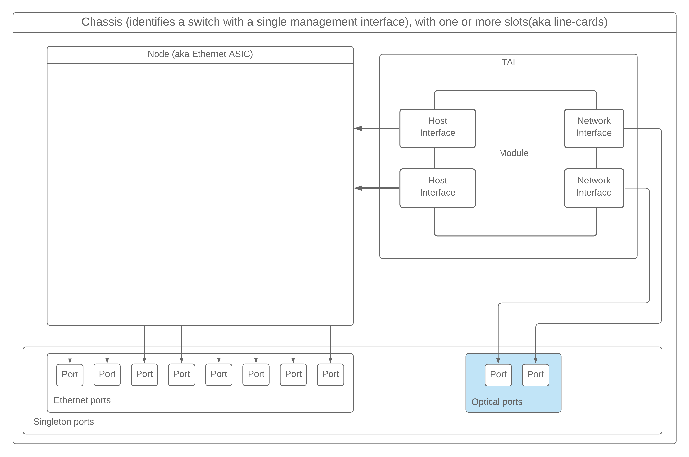
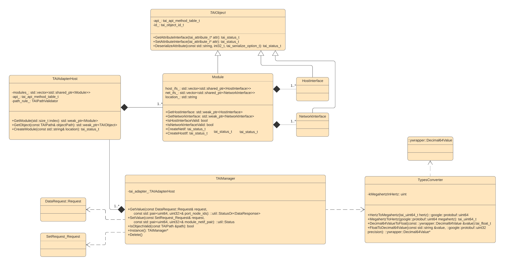
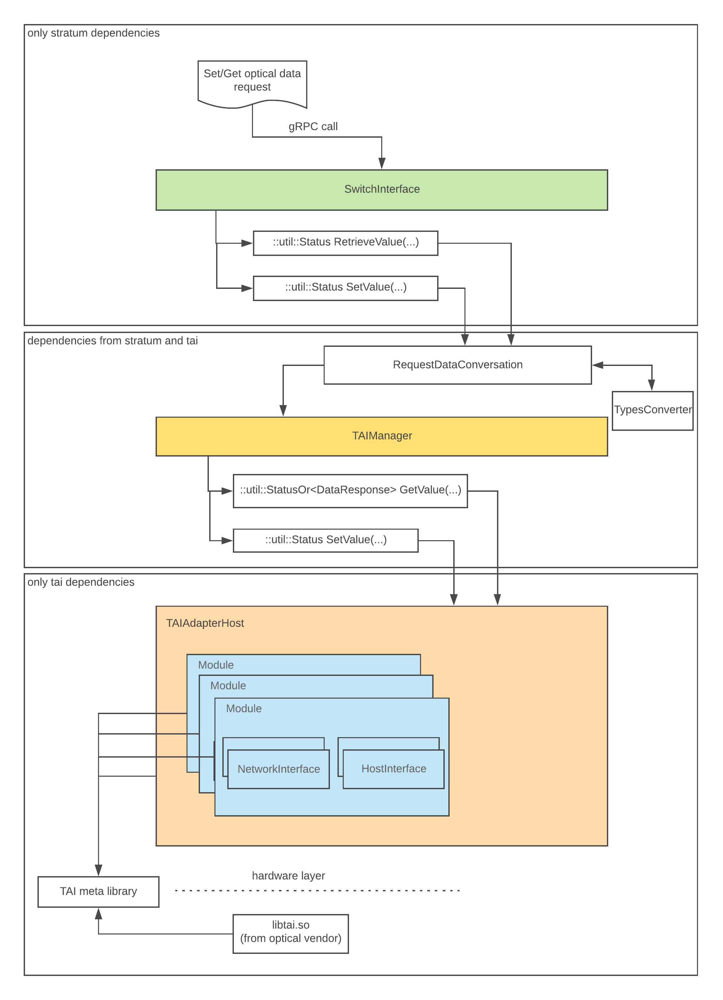
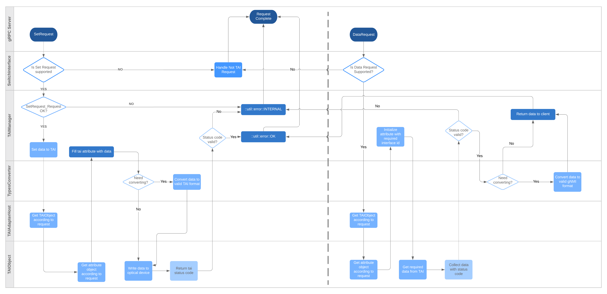

### Summary

The purpose of this page is to provide an overview of the [TAI library](https://github.com/Telecominfraproject/oopt-tai) and interaction with TAI library wrapper and [Stratum](https://github.com/stratum/stratum).

Let's deal with the terminology:

*   TAI(Transponder Abstraction Interface) - is an interface specification implemented as a collection of C-language header files.
*   TAI Adapter Host - is hardware-independent software which uses the TAI interface to provide optical transponder functionality to other parts of the system. An adapter host loads the shared library adapter.
*   TAI Module - is object which represent an optical module (like [AC400](https://acacia-inc.com/product/ac400-flex/) that is used in [Voyager transponder](https://engineering.fb.com/connectivity/an-open-approach-for-switching-routing-and-transport/)).
*   TAI Host Interface(hostif) - is object which represents an interface between an optical module and the host system, sometimes called client interfaces. Actually, this is an interface between an optical module and Ethernet ASIC.
*   TAI Network Interface(netif) - is object which represents hardware components that transmits/receives one wavelength. Or in other words, this is actually hardware that caries about an optical connection.

### 1\. Configuration

First that you need to know is that concrete implementation of TAI lib for some module already knows how many Modules, Network and Host Interfaces it has (for example number of netifs(Network Interfaces) inside [AC400](https://github.com/Telecominfraproject/oopt-tai-implementations/blob/master/tai_ac400/inc/voyager.h#L22)).

Interaction with TAI Manager begins from chassis config where the user should configure the correct optical module, netif location to port binding.

Here how optical_port configuration is represented in chassis config:

```
optical_ports {
  id: 3
  name: "card-1"
  slot: 1
  port: 3
  channel: 1
  node: 1
  frequency: 193500000000000
  target_output_power: 0
  operational_mode: 2
  line_port: "brcm1-brcm2"
  module_location: 1
  netif_location: 0
}
```

in example above we bind optical port with id=3 to netif with location 0 at module with location 1\. In other words when switch interface will get a request for port_id=4 and node_id=1 then you will request an optical port(netif) with netif location: 1 and module location: 0.

Here is a schematic main [common.proto](https://github.com/stratum/stratum/blob/master/stratum/hal/lib/common/common.proto#L292) component's architecture extended with singleton optical ports required for TAI lib (pic 1.1):



pic 1.1 main common.proto components

### 2\. TAI related classes



Main class from which user will begin to interact with TAI is TAIManager.

TAIManager - is interface class(implemented as singleton) used to interact with TAI library(get/set values). TAIManager converts gNMI requests to TAI requests and passes them to TAIAdapterHost.

TAIAdapterHost - is class which creates all needed TAIObjects on TAI manager's layer(Module, HostInterface, and NetworkInterface) and provides implantation of [module_presence](https://github.com/Telecominfraproject/oopt-tai/blob/master/inc/tai.h#L90) function used by vendor specific TAI implementation for module presence notification.

[Module](https://github.com/Telecominfraproject/oopt-tai#module-objects) - class which represents TAI Module object in the TAI Manager layer allowing to configure multiple Modules's attributes [tai_module_attr_t](https://github.com/Telecominfraproject/oopt-tai/blob/master/inc/taimodule.h#L88). Also, Module creates and contains HostInterface and NetworkInterface TAI objects.

[HostInterface](https://github.com/Telecominfraproject/oopt-tai#host-interface-objects) - class which represents TAI HostInterface object in the TAI Manager layer allowing to configure multiple HostInterface's attributes [tai_host_interface_attr_t](https://github.com/Telecominfraproject/oopt-tai/blob/master/inc/taihostif.h#L85). A host interface object represents an interface between an optical module and the host system, sometimes called client interfaces.

[NetworkInterface](https://github.com/Telecominfraproject/oopt-tai#network-interface-objects) - class which represents TAI NetworkInterface object in the TAI Manager layer allowing to configure multiple NetworkInterface's attributes [tai_network_interface_attr_t](https://github.com/Telecominfraproject/oopt-tai/blob/master/inc/tainetworkif.h#L162). A network interface object represents hardware components that transmits/receives one wavelength.

In the picture bellow you can see how SwitchInterface interacts with TAI manager at a very high level.



### 3\. Stratum TAI interaction

On the image below you may find the detailed algorithm of how Stratum interacts with TAI Manager layer and how T'AI manager processes gNMI get/set requests:

