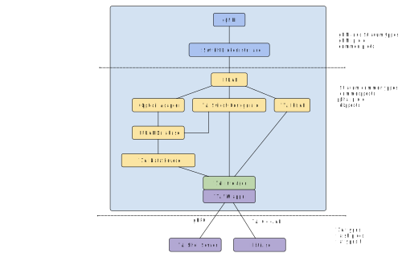
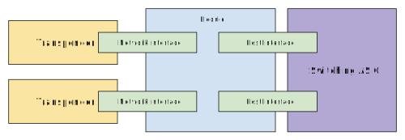

<!--
Copyright 2020 PLVision
Copyright 2020-present Open Networking Foundation

SPDX-License-Identifier: Apache-2.0
-->
# Transponder Abstraction Interface(TAI) support

This document provides an overview of the [TAI library](https://github.com/Telecominfraproject/oopt-tai) and interaction with TAI library wrapper and Stratum.

## The Overview

Figure below shows the overview of components which related to TAI support, we will cover these components from bottom to the top in following sections.



## Terminology

* Adapter Host - is hardware-independent software which uses the TAI interface to provide optical transponder functionality to other parts of the system. An adapter host loads the shared library adapter.

* Module - is an object which represent an optical module (e.g., [AC400](https://acacia-inc.com/product/ac400-flex/) that is used in [Voyager transponder](https://engineering.fb.com/connectivity/an-open-approach-for-switching-routing-and-transport/)).

* Host Interface - is an object which represents an interface between an optical module and the host system, sometimes called client interface. Actually, this is an interface between an optical module and Ethernet ASIC.

* Network Interface - is an object which represents hardware components that transmits/receives one wavelength. Or in other words, this is actually hardware that caries about an optical connection.



## Enabling TAI Support in Stratum

To build PHAL with the TAI backend, add the following define to all Bazel build commands:

`bazel build --define phal_with_tai=true //stratum/...`

Follow the relevant build instructions for [Broadcom chips](stratum/hal/bin/bcm/standalone/README.md) as usual.

### Additional TAI Switch Setup

When built like described above, the Debian package will depend on the TAI
package being available on the switch as well. To prepare the switch, download
the pre-built package `cassini-tai_1.0_amd64.deb` from your distributor and
install it:

`apt-get install --reinstall cassini-tai_1.0_amd64.deb`

The TAI package itself depends on Docker, so you might want to
[install](https://docs.docker.com/engine/install/debian/) that first.

TAI is managed by systemd, so use the usual commands to manage that:

- `systemctl start taish-server.service` # status|stop
- `systemctl enable taish-server.service`
- `journalctl -feu taish-server`

### TAI Troubleshooting on Cassini

#### Optical ports (host interfaces) do not come up in the SDK
Occasionally the host interfaces will stop coming up in the SDK, but did so
before and the configuration did not change.

1. Stop Stratum
2. Stop Taish server: `systemctl stop taish-server.service`
3. Pull and re-insert the big line-cards from both switches (on both sides)
4. Start taish server: `systemctl start taish-server.service`
5. Check taish logs until this message appears: `docker logs -f taish-server`:
```
DEBUG [int tai::nel::HW::controller_status()@1866] [module(1)] auto traffic state: 3
DEBUG [int tai::nel::HW::controller_status()@1868] [module(1)] auto traffic err history: 0x0
DEBUG [int tai::nel::HW::controller_status()@1870] [module(1)] RX_LOS: false
DEBUG [int tai::nel::HW::controller_status()@1872] [module(1)] RXI-LOSI: false, MLD-LOL: false
```
6. Start Stratum
7. Check port status: `ps`

## Stratum TAI Interface and TAI Wrapper

### TAI Interface

The TAI interface provides an abstract interface between Stratum data source and the actual implementation.

This interface provides these function definitions for Stratum data source:

 - Get module, network interface, and host interface IDs
 - Get current input and output power
 - Get/Set TX laser frequency of a network interface
 - Get/Set target output power
 - Get/Set modulation format

### TAI Wrapper

A TAI Wrapper is an implementation of the TAI Interfcace.

There are two ways to manage optical transponders via TAI.

 - Native C/C++ API (tai.h)
 - gRPC TAI Shell (taish.proto)

In Stratum, we are using the [taish.proto][taish_proto] to create a gRPC client to communicate to TAI Shell. The Native C/C++ API is still work in progress.
For more information, see [taish_client.cc](../../hal/lib/phal/tai/taish_client.cc)

## PHAL integration

According to the current PHAL architecture, the following interfaces were implemented for TAI.

### TaiOpticsDataSource

This component provides a common layer between PHAL database and the TAI interface. It will call functions from TAI interface (the wrapper) directly to get/set information for a specific TAI network interface.

### OpticsAdapter

The optics adapter helps PHAL to access the PHAL database. It basically create a database get or set request based on the function call from PHAL layer and returns the result.

### TaiSwitchConfigurator

This component provides a default optical module and network interface configurations and it is responsible for configuring `PhalDB` during the initialization.

### TaiPhal

Enables `PhalBackendInterface` functionality for TAI. This component should manage the gNMI event writters and TAI wrapper state. Also, it should be able to help collecting transponder states.

> Note: This component is currently not implemented.

### PHAL Configuration

The `PhalInitConfig` was extended with the `PhalOpticalModuleConfig` config support.

In `PhalOpticalModuleConfig`, there will be one or many network interfaces in a module, each module or network interface
includes a special field called `vendor_specific_id` which is used for storing a
vendor specific identifier for different implementation. In this case(TAI), this
ID is repersent the object ID in TAI abstraction.

Here is an example of module config:

```
optical_modules {
  module: 1  # the 1-based index of the module
  network_interfaces {
    network_interface: 1  # the 1-based index of the network interface
    vendor_specific_id: 10  # the object id of the network interface
  }
  vendor_specific_id: 1  # the object id of the module
}
```

The new attributes were introduced into `PhalDB`.
Like PHAL config, there exists multiple optical module and each module can include several optical network interfaces.

```
message OpticalModule {
  message NetworkInterface {
    int32 id = 1;
    uint64 frequency = 2;           // Measured in Hz.
    double input_power = 3;         // Measured in dBm.
    double output_power = 4;        // Measured in dBm.
    double target_output_power = 5; // Measured in dBm.
    uint64 operational_mode = 6;
  }
  int32 id = 1;
  repeated NetworkInterface network_interfaces = 2;
}

message PhalDB {
  // ...
  repeated OpticalModule optical_modules = 6;
}
```
> Note that we are not supprting configuring the Hoet Interface in TAI for now. This may be a future task that contributed by the community.

## Supported OpenConfig models(gNMI paths)

The OpenConfig model provides an optical channel configuration. Below are YANG models on GitHub we are using for TAI support:

* https://github.com/openconfig/public/blob/master/release/models/platform/openconfig-platform-transceiver.yang;
* https://github.com/openconfig/public/blob/master/release/models/optical-transport/openconfig-terminal-device.yang.

The entire model represents the set of gNMI configuration paths. Here are supported paths.

### "state/..." paths (read only):

```
/components/component[name]/optical-channel/state/frequency
/components/component[name]/optical-channel/state/operational-mode
/components/component[name]/optical-channel/state/output-power/instant
/components/component[name]/optical-channel/state/input-power/instant
```

### "config/..." paths (read and write):

```
/components/component[name]/optical-channel/config/frequency
/components/component[name]/optical-channel/config/operational-mode
/components/component[name]/optical-channel/config/target-output-power
```

### Other paths:

```
/components/component[name]/name
/components/component[name]/config/name
```
 > Note: Both currently are read-only and report the component node name as well as Stratum doesn't support node renaming for now.


```
/components/component[name]/optical-channel/state/line-port
/components/component[name]/optical-channel/config/line-port
```

> Note: The line port should be a reference to another node.
> Currently, they are both read-only value, which has set through the initial ChassisConfig (for both "state" and "config").

```
/components/component[name]/state/type
```

> Note: will get "OPTICAL_CHANNEL" if it is an optical component

## ChassisConfig extensions

A new `OpticalNetworkInterface` protobuf message was introduced into the ChassisConfig.

It stores the data required by the Stratum to set up and some initial optical network interface configuration.

Here is an example of the optical network interface configuration.

```
optical_network_interfaces {
  id: 4 # the object id of TAI
  name: "card-1001"
  module: 1
  network_interface: 1
  target_output_power: -3
  line_port: "card-1001"
  frequency: 195000000000
  operational_mode: 2
}
```

## OpenConfig and TAI attributes mapping through the gNMI paths
Find the full TAI attributes' list here:
[https://github.com/Telecominfraproject/oopt-tai/blob/master/inc/tainetworkif.h](https://github.com/Telecominfraproject/oopt-tai/blob/master/inc/tainetworkif.h)

| `terminal-optical-channel-config` attribute | gNMI path under /comonents/component[name]/ | Corresponding TAI attribute            |
| ------------------------------------------- | ------------------------------------------- | -------------------- |
| `frequency`                                 | `config/frequency`                          | `TX_LASER_FREQ`      |
| `operational-mode`                          | `config/operational-mode`                   | `MODULATION_FORMAT`* |
| `target-output-power`                       | `config/target-output-power`                | `OUTPUT_POWER`       |


| `terminal-optical-channel-state` attribute | gNMI path under /comonents/component[name]/ | Corresponding TAI attribute            |
| ------------------------------------------ | ------------------------ | --------------------------- |
| `frequency`                                | `state/frequency`        | `TX_LASER_FREQ`             |
| `operational-mode`                         | `state/operational-mode` | `MODULATION_FORMAT`*        |
| `output-power`                             | `state/output-power`     | `CURRENT_OUTPUT_POWER`      |
| `input-power`                              | `state/input-power`      | `CURRENT_INPUT_POWER`       |

> Note: The "operational mode" is a vendor-specific configuration of the channel represented by 16 bits. In TAI, we set modulation only. The following table pictures the bidirectional mapping of operational mode and modulation.

| operational mode | modulation                    |
| :--------------: | ----------------------------- |
| 1         | `MODULATION_FORMAT_DP_QPSK`   |
| 2         | `MODULATION_FORMAT_DP_16_QAM` |
| 3         | `MODULATION_FORMAT_DP_8_QAM`  |

## Todos

### ChasisConfig to OpenConfig conversion and vise versa

Stratum supports the "Get"/"Set" operations for the entire ChassisConfig only in
the OpenConfig format. Applying/retrieving of the entire OpenConfig at once in
Stratum should be extended with the optical network interface.

### "/name" and "/line-port" complete implementation

Stratum doesn't support Yang tree nodes renaming. Since the "config/name" paths
represent the names of the actual nodes, they should be made configurable when
Stratum supports that.

### Collecting data from optical network interfaces

In OpenConfig model, there are few leaves which stores min, max, and average input/output power of a network interface.
However, TAI does not provide these data. We need to collect those information and store in Stratum.

### Notification support
Support notification such as input/output power report.

[taish_proto]: https://github.com/Telecominfraproject/oopt-tai/blob/master/tools/taish/proto/taish/taish.proto