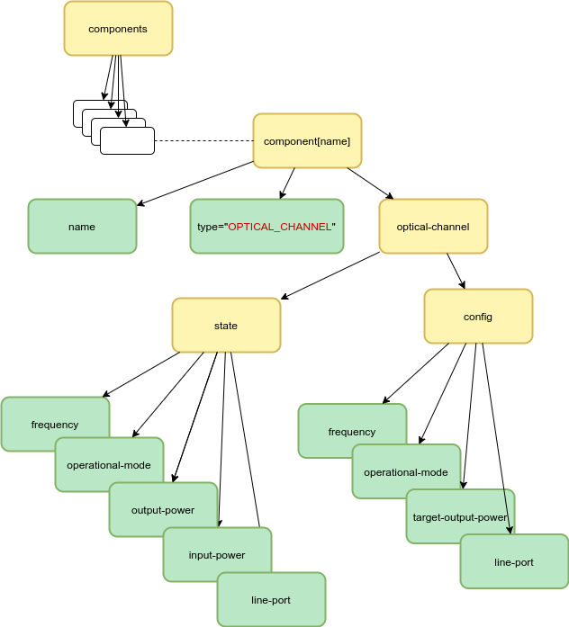
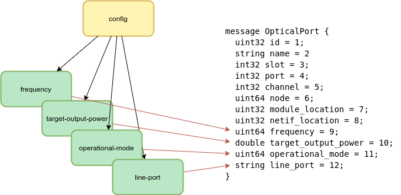
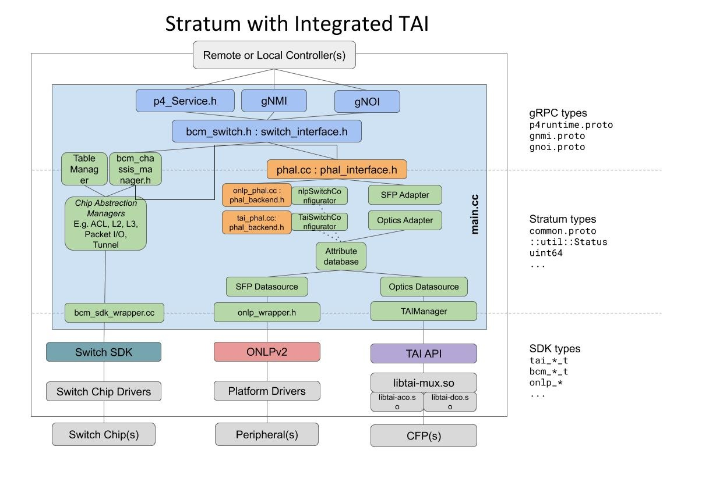
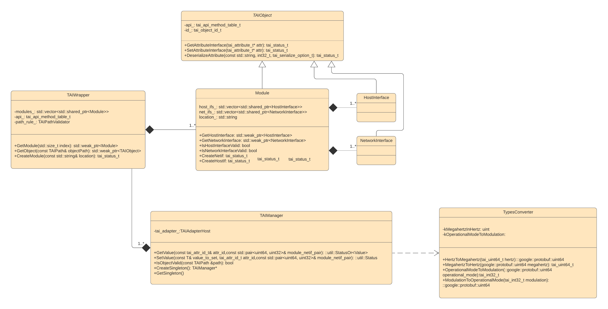
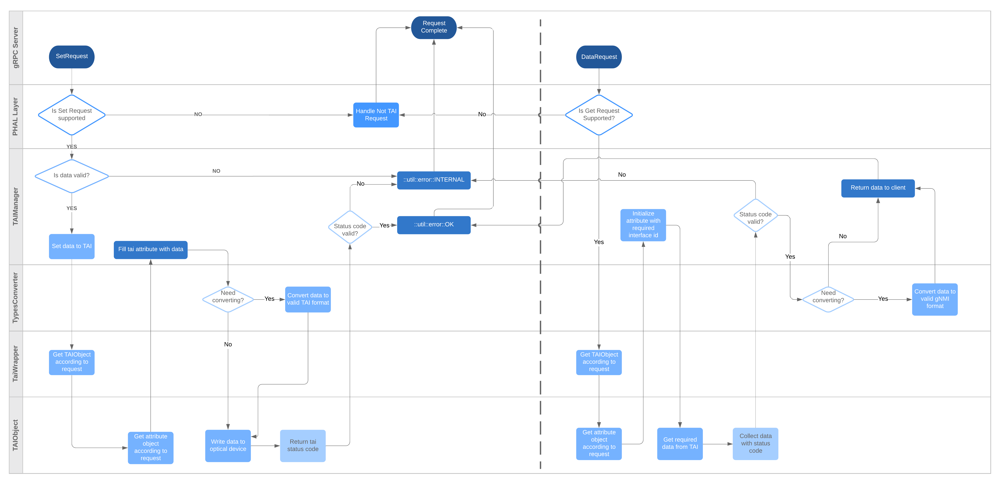

# Stratum interface part

## Supported OpenConfig models

The OpenConfig model provides an optical channel configuration. Find the
complete YANG models on GitHub:

* https://github.com/openconfig/public/blob/master/release/models/platform/openconfig-platform-transceiver.yang;
* https://github.com/openconfig/public/blob/master/release/models/optical-transport/openconfig-terminal-device.yang.

Here's the YANG model of optical channel attributes, which are implemented in
Stratum.



Here's the simplified implementation of it.

```
grouping terminal-optical-channel-state {
  description
    "Operational state data for optical channels";

  container output-power { ... }
  container input-power { ... }
}

grouping terminal-optical-channel-config {
  description
    "Configuration data for describing optical channels";

  leaf frequency { ... }
  leaf operational-mode { ... }
  leaf target-output-power { ... }
}
```

This data is encapsulated into an optical channel container.

```
container optical-channel {

  # Writable attributes.
  container config {
    uses terminal-optical-channel-config;
  }

  # Readable attributes.
  # Note. Both config and state groupings are included.
  container state {
    uses terminal-optical-channel-config;
    uses terminal-optical-channel-state;
  }
}
```

That container belongs to its parent component. Each component must have its
unique name and leaves under the /components path.

```
container components {
  list components {
    key: "name"

    leaf name { ... }
    leaf type { ... }

    # Recursively includes optical-channel container too.
  }
}
```

The entire YANG model represents the set of gNMI configuration paths. Here's the
supported subset.

### "state/..." paths (read-only):
```
/components/component[name]/optical-channel/state/frequency

/components/component[name]/optical-channel/state/operational-mode

# Note. Reports the actual optical power values retrieved from TAI.
# Represented by "CURRENT_OUTPUT_POWER" aattribute in TAI.
/components/component[name]/optical-channel/state/output-power/instant
                                                              |avg
                                                              |interval
                                                              |max
                                                              |max-time
                                                              |min
                                                              |min-time

/components/component[name]/optical-channel/state/input-power/instant
                                                             |avg
                                                             |interval
                                                             |max
                                                             |max-time
                                                             |min
                                                             |min-time
```

### "config/..." paths:
```
/components/component[name]/optical-channel/config/frequency

/components/component[name]/optical-channel/config/operational-mode

# Note. Means a desired optical power value.
# Represented by "OUTPUT_POWER" aattribute in TAI.
/components/component[name]/optical-channel/config/target-output-power
```

### Other paths:
```
# Note. Both currently are READ-ONLY and report the component node name
# as well as Stratum doesn't support node renaming for now.
/components/component[name]/name
/components/component[name]/config/name

# Note. The line port should be a reference to another YANG node.
# Currently, it's READ-ONLY and returns the value, which has set
# through the initial ChassisConfig (for both "state" and "config").
/components/component[name]/optical-channel/state/line-port
/components/component[name]/optical-channel/config/line-port

# Note. Reports "OPTICAL_CHANNEL" for ".../optical-channel/..." nodes.
# Does nothing for other nodes.
/components/component[name]/state/type
```

## ChassisConfig extensions

A new OpticalPort "protobuf" message was introduced into the ChasisConfig. It
stores the data required by the YANG tree to be set up and some initial optical
port configuration.



Here's the example of the optical port configuration.

```
optical_ports {
  id: 3
  name: "card-1"
  slot: 1
  port: 3
  channel: 1
  node: 1
  module_location: 0
  netif_location: 0
  frequency: 193500000000000
  target_output_power: 0
  operational_mode: 2
  line_port: "oe-17"
}
```

## OpenConfig and TAI attributes mapping through the gNMI paths
Find the full TAI attributes' list here:
https://github.com/Telecominfraproject/oopt-tai/blob/master/inc/tainetworkif.h.

| `terminal-optical-channel-config` attribute | gNMI path under /comonents/component[name]/ | Corresponding TAI attribute            |
| ------------------------------------------- | ------------------------------------------- | -------------------- |
| `frequency`                                 | `config/frequency`                          | `TX_LASER_FREQ`      |
| `operational-mode`                          | `config/operational-mode`                   | `MODULATION_FORMAT`* |
| `target-output-power`                       | `config/target-output-power`                | `OUTPUT_POWER`       |

| `terminal-optical-channel-state` attribute | gNMI path under /comonents/component[name]/ | Corresponding TAI attribute            |
| ------------------------------------------ | ------------------------ | --------------------------- |
| `frequency`                                | `state/frequency`        | `TX_LASER_FREQ`             |
| `operational-mode`                         | `state/operational-mode` | `MODULATION_FORMAT`*        |
| `output-power`                             | `state/output-power`     | `CURRENT_OUTPUT_POWER`      |
| `input-power`                              | `state/input-power`      | `CURRENT_INPUT_POWER`       |

*Note. The "operational mode" is a vendor-specific configuration of the channel
represented by 16 bits. In TAI, we set modulation only. The following table
pictures the bidirectional mapping of operational mode (in binary format) and
modulation.

| operational mode | modulation                    |
| :--------------: | ----------------------------- |
| 00000001         | `MODULATION_FORMAT_DP_QPSK`   |
| 00000010         | `MODULATION_FORMAT_DP_16_QAM` |
| 00000011         | `MODULATION_FORMAT_DP_8_QAM`  |

## Todos

### ChasisConfig to OpenConfig conversion and vise versa
Stratum supports the "Get"/"Set" operations for the entire ChassisConfig only in
the OpenConfig format. Applying/retrieving of the entire OpenConfig at once in
Stratum should be extended with the optical part.

### "/name" and "/line-port" complete implementation
Stratum doesn't support YANG tree nodes renaming. Since the "config/name" paths
represent the names of the actual nodes, they should be made configurable when
Stratum supports that.

# PHAL part

## PHAL with TAI architecture


According to the current PHAL architecture, the following interfaces were
implemented for TAI purposes.

The `OpticsAdapter` class provides the interface to access and modify the
`PhalDB` with the new optical attributes.

```
class OpticsAdapter final : public Adapter {

  ::util::Status GetOpticalTransceiverInfo(int slot, int port,
                                           OpticalChannelInfo* oc_info);

  ::util::Status SetOpticalTransceiverInfo(int slot, int port,
                                           const OpticalChannelInfo& oc_info);
};
```

The `TaiPhal` class enables `PhalBackendInterface` functionality for TAI.
Currently is not implemented.

```
class TaiPhal final : public PhalBackendInterface {

  ::util::Status PushChassisConfig(const ChassisConfig& config) override;

  ::util::Status VerifyChassisConfig(const ChassisConfig& config) override

  ::util::Status Shutdown() override LOCKS_EXCLUDED(config_lock_);
};
```

The `TaiSwitchConfigurator` class provides a default optical card configuration
and is responsible for configuring `PhalDB` on initialization.

```
class TaiSwitchConfigurator final : public SwitchConfiguratorInterface {

  ::util::Status CreateDefaultConfig(PhalInitConfig* config) const override;

  ::util::Status ConfigurePhalDB(PhalInitConfig* config,
                                 AttributeGroup* root) override;
};
```

The `TaiOpticsDataSource` class provides values from THAI to database

```
class TaiOpticsDataSource : public DataSource {
 public:
  static ::util::StatusOr<std::shared_ptr<TaiOpticsDataSource>> Make(
      int id, const PhalOpticalCardConfig& config);

  // Accessors for managed attributes.
  ManagedAttribute* GetModuleSlot() { return &module_slot_; }
  ManagedAttribute* GetModuleHardwareState() { return &module_hw_state_; }
  ManagedAttribute* GetModuleVendor() { return &card_vendor_; }

  ManagedAttribute* GetTxLaserFrequency() { return &tx_laser_frequency_; }
  ManagedAttribute* GetModulationFormat() { return &modulation_format_; }
  ManagedAttribute* GetOutputPower() { return &output_power_; }
  ManagedAttribute* GetCurrentOutputPower() { return &current_output_power_; }
  ManagedAttribute* GetInputPower() { return &input_power_; }

  // Setter functions.
  ::util::Status SetTxLaserFrequency(int slot, uint64 tx_laser_frequency);
  ::util::Status SetModulationFormat(int slot, uint64 modulation_format);
  ::util::Status SetOutputPower(int slot, double output_power);

  ::util::Status PushPhalConfig(const PhalOpticalCardConfig& config);
};

```

`PhalInitConfig` was extended with the `OpticalCard` config support.

```
message PhalOpticalCardConfig {
  int32 slot = 1;
  CachePolicyConfig cache_policy = 2;
}

message PhalInitConfig {
  repeated PhalOpticalCardConfig optical_cards;
}
```

The new attributes were introduced into `PhalDB`.

```
message OpticalTransceiver {
  int32 id = 1;
  string vendor_name = 2;
  HwState hardware_state = 3;
  uint64 frequency = 4;           // Measured in Hz.
  double input_power = 5;         // Measured in dBm.
  double output_power = 6;        // Measured in dBm.
  double target_output_power = 7; // Measured in dBm.
  uint64 operational_mode = 8;
}

message PhalDB {
  repeated OpticalTransceiver optical_cards;
}
```

## Todos

### TaiOpticsDataSource update
Update `TaiOpticsDataSource` class to support multiple network interfaces.

# TAI part

### Summary

The purpose of this page is to provide an overview of the [TAI library](https://github.com/Telecominfraproject/oopt-tai) and interaction with TAI library wrapper and [Stratum](https://github.com/stratum/stratum).

Let's deal with the terminology:

*   TAI(Transponder Abstraction Interface) - is an interface specification implemented as a collection of C-language header files.
*   TAI Adapter Host - is hardware-independent software which uses the TAI interface to provide optical transponder functionality to other parts of the system. An adapter host loads the shared library adapter.
*   TAI Module - is object which represent an optical module (like [AC400](https://acacia-inc.com/product/ac400-flex/) that is used in [Voyager transponder](https://engineering.fb.com/connectivity/an-open-approach-for-switching-routing-and-transport/)).
*   TAI Host Interface(hostif) - is object which represents an interface between an optical module and the host system, sometimes called client interfaces. Actually, this is an interface between an optical module and Ethernet ASIC.
*   TAI Network Interface(netif) - is object which represents hardware components that transmits/receives one wavelength. Or in other words, this is actually hardware that caries about an optical connection.

### 1\. Configuration

First that you need to know is that concrete implementation of TAI lib for some module already knows how many Modules, Network and Host Interfaces it has (for example number of netifs(Network Interfaces) inside [AC400](https://github.com/Telecominfraproject/oopt-tai-implementations/blob/master/tai_ac400/inc/voyager.h#L22)).

Interaction with TAI Manager begins from chassis config where the user should configure the correct optical module, netif location to port binding.

Here how optical_port configuration is represented in chassis config:

```
optical_ports {
  id: 3
  name: "card-1"
  slot: 1
  port: 3
  channel: 1
  node: 1
  frequency: 193500000000000
  target_output_power: 0
  operational_mode: 2
  line_port: "brcm1-brcm2"
  module_location: 1
  netif_location: 0
}
```

in example above we bind optical port with id=3 to netif with location 0 at module with location 1\. In other words when switch interface will get a request for port_id=4 and node_id=1 then you will request an optical port(netif) with netif location: 1 and module location: 0.

Here is a schematic main [common.proto](https://github.com/stratum/stratum/blob/master/stratum/hal/lib/common/common.proto#L292) component's architecture extended with singleton optical ports required for TAI lib (pic 1.1):


pic 1.1 main common.proto components

### 2\. TAI related classes



Main class from which user will begin to interact with TAI is TAIManager.

TAIManager - is interface class(implemented as singleton) used to interact with TAI library(get/set values). TAIManager converts gNMI requests to TAI requests and passes them to TAIAdapterHost.

TAIAdapterHost - is class which creates all needed TAIObjects on TAI manager's layer(Module, HostInterface, and NetworkInterface) and provides implantation of [module_presence](https://github.com/Telecominfraproject/oopt-tai/blob/master/inc/tai.h#L90) function used by vendor specific TAI implementation for module presence notification.

[Module](https://github.com/Telecominfraproject/oopt-tai#module-objects) - class which represents TAI Module object in the TAI Manager layer allowing to configure multiple Modules's attributes [tai_module_attr_t](https://github.com/Telecominfraproject/oopt-tai/blob/master/inc/taimodule.h#L88). Also, Module creates and contains HostInterface and NetworkInterface TAI objects.

[HostInterface](https://github.com/Telecominfraproject/oopt-tai#host-interface-objects) - class which represents TAI HostInterface object in the TAI Manager layer allowing to configure multiple HostInterface's attributes [tai_host_interface_attr_t](https://github.com/Telecominfraproject/oopt-tai/blob/master/inc/taihostif.h#L85). A host interface object represents an interface between an optical module and the host system, sometimes called client interfaces.

[NetworkInterface](https://github.com/Telecominfraproject/oopt-tai#network-interface-objects) - class which represents TAI NetworkInterface object in the TAI Manager layer allowing to configure multiple NetworkInterface's attributes [tai_network_interface_attr_t](https://github.com/Telecominfraproject/oopt-tai/blob/master/inc/tainetworkif.h#L162). A network interface object represents hardware components that transmits/receives one wavelength.

In the picture bellow you can see how SwitchInterface interacts with TAI manager at a very high level.


### 3\. Stratum TAI interaction

On the image below you may find the detailed algorithm of how Stratum interacts with TAI Manager layer and how T'AI manager processes gNMI get/set requests:



## Todos

### Notification support
Implement notifications support for TAIManager layer.

### Input/output power statistics
From the OpenConfig perspective, the input/output power attributes support the
statistical data gathering and reporting. The new functionality should be
introduced in TAIManager (or elsewhere at TAI level) to gather those statistics.
