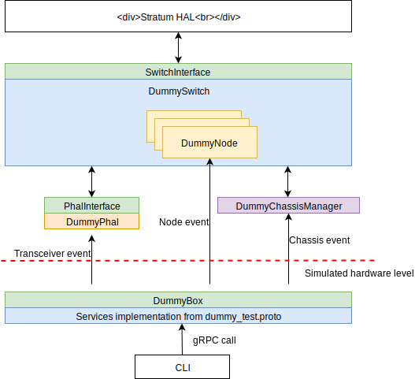

<!--
Copyright 2018-present Open Networking Foundation

SPDX-License-Identifier: Apache-2.0
-->

Dummy Stratum switch (stratum_dummy)
====

This Stratum target is designed for verifying the control plane application and provides a reference for developers to create new Stratum target.

## Target architecture


## Building the `stratum_dummy` binary

The `stratum_dummy` binary is a standalone executable which includes following implementation:

1. SwitchInterface
2. PhalInterface
3. ChassisManager
4. Node

To build the `stratum_dummy`:

```
bazel build //stratum/hal/bin/dummy:stratum_dummy
```

## Running the `stratum_dummy` binary

```
bazel run //stratum/hal/bin/dummy:stratum_dummy \
  -- \
  --persistent_config_dir=/tmp/ \
  --chassis_config_file=$(bazel info workspace)/stratum/hal/bin/dummy/chassis_config \
  --forwarding_pipeline_configs_file=/tmp/dummy_pipeline_cfg \
  --enable_onlp=false
```

You can ignore the following error, we are working on fixing it:

```
E1010 11:14:51.569034 25164 utils.cc:120] StratumErrorSpace::ERR_FILE_NOT_FOUND:  not found.
E1010 11:14:51.569039 25164 utils.cc:76] Return Error: ReadFileToString(filename, &text) failed with StratumErrorSpace::ERR_FILE_NOT_FOUND:  not found.
W1010 11:14:51.569043 25164 p4_service.cc:134] No saved forwarding pipeline config found at . This is normal when the switch is just installed and no master controller is connected yet.
```

After the dummy switch started, should should be able to see two tcp ports listened by Stratum and the test service:

```
netstat -tpl | grep stratum_dummy
tcp6       0      0 localhost:28010         [::]:*                  LISTEN      17101/stratum_dummy
tcp6       0      0 localhost:28010         [::]:*                  LISTEN      17101/stratum_dummy
tcp6       0      0 [::]:28000              [::]:*                  LISTEN      17101/stratum_dummy
tcp6       0      0 localhost:28000         [::]:*                  LISTEN      17101/stratum_dummy
tcp6       0      0 localhost:28000         [::]:*                  LISTEN      17101/stratum_dummy
```

## Using CLI to simulate device status change events

The CLI uses python modules compiled from following proto files:
- stratum/hal/lib/dummy/dummy_test.proto
- stratum/hal/lib/common/common.proto

Usage:

```
usage: cli.py [-h] [--dry-run] [--test-service-url TEST_SERVICE_URL]
              {oper_status,admin_status,mac_address,port_speed,negotiated_port_speed,
              lacp_router_mac,lacp_system_priority,port_counters,forwarding_viability,
              health_indicator,node_packetio_debug_info,memory_error_alarm,
              flow_programming_exception_alarm,port_qos_counters}
              ...
```

The state string (e.g. oper_status) is based on the DataResponse from common.proto which allows user to update device state.

For example:

```
bazel run //stratum/hal/bin/dummy:cli oper_status 1 1 PORT_STATE_DOWN
```

## Simulate port counter update events

To simulate port counter events, need to build python script first:

Usage:
```
usage: port_counter_sim [-h] [--dry-run]
                        [--test-service-url TEST_SERVICE_URL]
                        [--delay DELAY]
                        node-id port-id
```

For example, we want to generate port counter update event for node 1 port 1 every second:
```
bazel run //stratum/hal/bin/dummy:port_counter_sim 1 1
```
