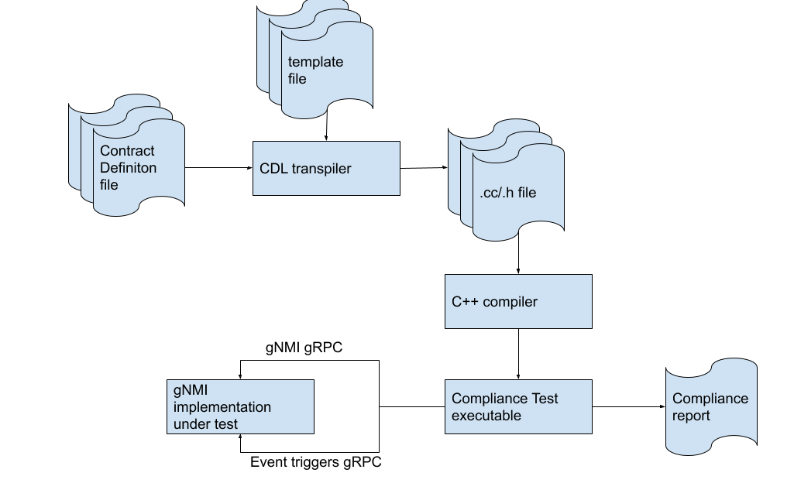

# CDLang gNMI Compliance Definition Language

## SUMMARY

CDLang is an extendable framework that allows for both: to define human-readable
scenarios and to use those scenarios to generate code that when executed
checks compliance of the gNMI/OpenConfig part of the contract between an
controller and a switch.

## OBJECTIVE

There are two main goals of this project:

* Define a contract listing all gNMI/OpenConfig features, options and usage
  scenarios that must be supported by a device to be considered for deployment
  in Google's data center

* Create a tool that will use the contract files as an input and use them to
  check if the switch under test complies with them

## BACKGROUND

Both gNMI and OpenConfig specifications are huge and list massive number of
features, options and entities. This is understandable, as their goal is to
cover all aspects of a network devices configuration, but in a particular usage
scenario, like Google's data center network, only a small part of those specs is
applicable. How small and which elements are actually needed, is not obvious
from the analysis of those specifications and they need to be explicitly
specified in order to make sure that all interested parties support the right
set.

Moreover, there is a need to make sure that a third-party's implementation of
the required features and options is complete without comparing the feature list
or manually testing the switch.

Additional complexity is added by the fact that OpenConfig management model is
not a simple 'fire-and-forget' protocol but heavily depends on the sequence of
operations as well as notifications sent by the switch in response to external
events.

## OVERVIEW

Due to the sequential nature of the gNMI/OpenConfig protocol, the best way to
describe the contract is to create a set of scenarios focusing on specific usage
case and explicitly list messages being exchanged interleaved with event
triggers and content checks.
Once created, those scenarios can be used to develop (generate) tests that will
check if the device under test is following the expected behavior.

To make the development of the scenario files easier for humans
a domain-specific language called Compliance Definition Language (CDLang) is
used. Moreover, usage of formal description language allows for the development
of a transpiler that will automatically convert the contract definition files
into unit tests that will be compiled and executed as well as to generate
documentation.

A processing pipeline is presented below.



### Non-goals

The project covers the compliance of a switch, but does not check the compliance
of the controller that will be configuring it - it is assumed that the team
developing the controller will make sure that all features used by their
software are listed in the contract definition files.

## DETAILED DESIGN

### Compliance Definition Language

Below are presented examples of scenarios that might be part of the contract.
They are used to show the purpose of the elements of CDLang syntax.

#### Example 1: Subscribe:ONCE to learn the names of all interfaces

This example presents the very first interaction of a controller with a switch
and its purpose is to learn the names used by the switch to describe its
interfaces and corresponding ifindex values.

As seen in the snipped below the scenario consists of 3 steps:

1. Sending of a subscribe request in ONCE mode with path specified as
  `"/interfaces/interface[name=*]/state/ifindex"`. The format is almost the same
  as the one of a PROTOBUF with exception of the `path` element that uses YANG
  path representation (which is much more compact and easier for a human to
  grasp).

  The side-effect of executing this instruction is the creation of a stream
  `stream` that is then used to receive messages in step 2 and 3.

1. Receiving one or more responses each containing two pieces of information,
  namely:

  * Path with actual interface name instead of the star

  * `ifindex`

  Those values should be unique and the name of the interface can contain only
  letters, a dot or a colon.

1. Receiving as the very last message, just before the connection is closed,
  a message with `sync_response` flag set to `true`.

```
scenario GetAllInterfaces() version 1.0.0 {
  gnmi := gNMI.Subscribe
  gnmi << SubscribeRequest {
         subscribe {
             subscription [ { path: /interfaces/interface[name=*]/state/ifindex } ]
             mode: ONCE } }
  AtLeastOnce {
    gnmi >> SubscribeResponse {
              update {
                update [ {
                  path: /interfaces/interface[$ifname:=name]/state/ifindex
                  val { int_val: #ifindex } } ] } }
  }
  gnmi >> SubscribeResponse { sync_response: true }
  close gnmi
}

```

#### Example 2: Subscribe for interface operational state changes

This example shows how the controller is notified about the changes of the
operational state of an interface.

This scenario consists of the following steps:

1. Sending a subscription request that requests a notification every time the
  state changes.
  The side-effect of executing this instruction is the creation of a stream
  `stream` that is then used to receive messages in steps from 2 to 7.

1. Receiving a response that contains the current operational state of the
  interface

1. Receiving a message with `sync_response` flag set to `true` that denotes the
  end of the sequence of messages with the initial state.

1. Sending a request to bring the port up.

1. The request to bring the port up should result in receiving two messages:

  * Confirmation that the port has been brought up

  * gNMI notification that the port has been brought up

  Depending on the implementation of the test environment the messages will be
  received in shown above or reverse order. So, as there is no way to say which
  one should be received first and which should be received second, those two
  messages are grouped to denote that there is an expectation that they will be
  received but there is no assumption about their order.

1. Sending a request to bring the port down.

1. Again, the request to bring the port down should result in receiving two
  messages:

  * Confirmation that the port has been brought down

  * gNMI notification that the port has been brought down

Note that this scenario requires a name of an interface to subscribe to.
There are multiple ways to provide it, but one that is most vendor-agnostic is
to select one of the interfaces reported by the switch. This is done by the
second scenario listed below. It uses the same strategy to learn the names of
the interfaces as the one described in the example #1:

1. Sending of a subscribe request in `ONCE` mode with path specified as
  `"/interfaces/interface[name=*]/state/ifindex"`

1. Receiving one response containing two pieces of information, namely:

  * Path with actual interface name instead of the star

  * `ifindex`

1. The interface name is used to execute the above described scenario.

1. Receiving zero or more responses which are ignored.

1. Receiving as the very last message, just before the connection is closed,
  a message with `sync_response` flag set to `true`.

```
scenario SubscribeOperState(ifname: string) version 1.0.0 {
  // Set initial state of the interface: DOWN.
  ctrl := gNOI.Execute
  ctrl << ExecuteRequest { step { port_event { port_id: $ifname state: DOWN } } }
  ctrl >> ExecuteResponse { success: true }

  // Subscribe for changes of interface's operational state.
  gnmi := gNMI.Subscribe
  gnmi << SubscribeRequest {
         subscribe {
             mode: STREAM
             subscription [ {
                 path: /interfaces/interface[name=$ifname]/state/oper-status
                 mode: ON_CHANGE } ] } }
  // Correct response includes current state of the interface...
  gnmi >> SubscribeResponse {
         update {
           update [ {
             path: /interfaces/interface[name=$ifname]/state/oper-status
             val { string_val: "DOWN" } } ] } }
  // ... and marker denoting the end of initial state notifications.
  gnmi >> SubscribeResponse { sync_response: true }

  // Bring up the interface - a notification is expected.
  ctrl << ExecuteRequest { step { port_event { port_id: $ifname state: UP } } }
  AnyOrder {
    ctrl >> ExecuteResponse { success: true }
    gnmi >> SubscribeResponse {
           update {
             update [ {
               path: /interfaces/interface[name=$ifname]/state/oper-status
               val { string_val: "UP" } }
               ] } }
  }

  // Bring down the interface - a notification is expected.
  ctrl << ExecuteRequest { step { port_event { port_id: $ifname state: DOWN } } }
  AnyOrder {
    ctrl >> ExecuteResponse { success: true }
    gnmi >> SubscribeResponse {
         update {
           update [ {
             path: /interfaces/interface[name=$ifname]/state/oper-status
             val { string_val: "DOWN" } } ] } }
  }
  close gnmi
  close ctrl
}

scenario SubscribeOperStateOnFirstInterface() version 1.0.0 {
  // Get list of all interfaces and their ifindexes.
  gnmi := gNMI.Subscribe
  gnmi << SubscribeRequest {
         subscribe {
             mode: ONCE
             subscription [ { path: /interfaces/interface[name=*]/state/ifindex } ] } }

  // First response is used to learn name of the interface that will be used in the next
  // part of the scenario.
  gnmi >> SubscribeResponse {
         update {
           update [ {
             path: /interfaces/interface[$ifname:=name]/state/ifindex
             val { int_val: _ } } ] } }

  // The interesting scenario - check the behavior of
  //     /interfaces/interface[name=$ifname]/state/oper-status
  execute SubscribeOperState( $ifname )

  // Consume the remaining reponses to the initial SubscribeRequest followed by the
  // marker denoting the end of updates.
  ZeroOrMore {
    gnmi >> SubscribeResponse { update { update [ { path: _ val { int_val: _ } } ] } }
  }
  gnmi >> SubscribeResponse { sync_response: true }
  close gnmi
}

```

### Anatomy of a scenario

A scenario is a sequence of steps that are needed to show (and check the
correctness of the implementation of those steps) a required functionality.

A scenario has the following elements:

* Unique name that identifies the scenario and describes the tested feature

* Version (check a section below for more details)

* List of steps that have to be executed

There are 6 types of steps:

* Build and send a gNMI request message

* Receive and verify gNMI response (or notification) message

* Build and send a stimulus gNOI request message

* Receive and verify stimulus gNOI response message

* Check is a value taken from the received gNMI responses (notifications)
  matches specified regular expression

* Grouping blocks

There are three types of grouping blocks:

* `AtLeastOnce`. All instructions listed in this block have to be executed the
  same number of times; at least once.

* `ZeroOrMore`. All instructions listed in this block have to be executed the
  same number of times; any number of times.

* `AnyOrder`. All instructions listed in this block have to be executed
  exactly one time, but not necessarily in the order they are listed in this
  block. This block is intended to address race condition between
  responses/notifications sent as a reaction to a stimulus request.

### Variables

Variables can have any name as long as it starts with `$`.
There are two ways to set their values:

* Passed as a parameter of a scenario

* Content of a field of a received message

`$_` is reserved for values that will be ignored.

### Versioning

There is no doubt that requirements, and therefore the contents of the contract,
will evolve over time. Usage of CDLang, and therefore standard text files, makes
not only possible but also easy for the third-party vendors to follow the
changes as well to identify which files have been modified - a simple diff
program will show the difference.

In CDLang each scenario is annotated with contract version and multiple versions
of a scenario are present in the contract file.

When execution of a compliance test of particular version is requested,
the transpiler tool will select version of the scenario that is equal to the
requested version. If the requested one does not exist, then it will select the
latest that is lower than the requested one.

For example: if there are three versions of a scenario: 1.0.0, 1.1.0 and 2.1.0
then for compliance test:

* For contract version 1.0.0,  scenario with version 1.0.0 is selected

* For contract version 2.0.0,  scenario with version 1.1.0 is selected

* For contract version 2.1.0,  scenario with version 2.1.0 is selected

### Implementation

#### The transpiler

It is a tool that uses external files containing Golang templates to generate
files based on the content of the contract files. As the template files are not
part of the binary (neither the contract) there can be multiple files to
generate various artifacts, like a PDF with pretty-looking version of the
contract, a Google Unit Test-based set of C++ files or a HTML file that renders
into a collapsible tree of supported paths with links to all scenarios that
cover a particular OpenConfig YANG model path.

Moreover, such an approach allows third-party vendors to use sample templates
to customize the generated output to fit to their testing environment.

#### The CDLang parser

The front-end of the transpiler is a CDLang parser. It is generated by antlr4,
an open-source tool, that takes a grammar definition file as an input.

It's job is to read a text file with a contract definition, parse it and produce
an Abstract Syntax Tree (AST) representing the content of the input files.

#### The AST handler

Once the AST is created it is processed by a series of objects that use the
Visitor Design Pattern to collect and post-process the data from the contract
and to build a Document Object Model, the DOM, that contains all the information
that is needed by the templates to generate output files.

#### The output file(s) generator

The Golang template engine is used to generate the output file(s). The engine
requires two pieces of information:

* The information defined by the contract - the DOM

* The template

## REJECTED ALTERNATIVES

### Actual Google Unit Test-based tests

* Not flexible.

* Not all vendors use Google Unit Test framework.

* Not every test environment can be adapted to use C++ unit test code.

* Hard to see 'big picture'. Details get lost in the sea of necessary support
  code.

### PROTOBUF as syntax

* Not really human-friendly.
  Yes, it can be represented in text form but its rigid, pre-defined structure
  makes it difficult to follow and it is very verbose.

* New set of protobuf definitions has to developed to represent necessary
  primitives, like 'ZeroOrMore', procedure (called in CDLang 'scenario').
